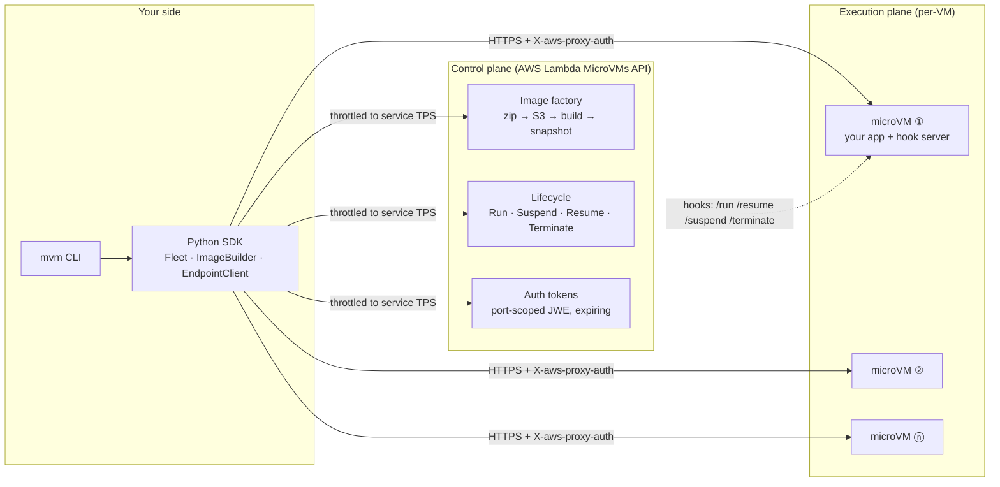

# awesome-microvm

**A production-grade control & execution plane for [AWS Lambda MicroVMs](https://docs.aws.amazon.com/lambda/latest/dg/lambda-microvms-guide.html)** — build snapshot images, spin up Firecracker microVMs in seconds, scale fleets up and down, call into them securely, watch them live, and pay only for the seconds you actually compute.

```
pip install -e .            # ships the lambda-microvms service model — works on any boto3
mvm bootstrap               # S3 artifact bucket + build/execution IAM roles
mvm image build code-sandbox examples/code-sandbox
mvm run code-sandbox --wait
mvm call <microvm-id> /execute -X POST -d '{"code":"print(2+2)"}'
mvm scale code-sandbox 10
mvm top --watch
```

Verified end-to-end against the live service (us-east-1): image builds in ~2 minutes, VMs serve traffic in seconds, suspend/resume preserves the process byte-for-byte (same PID), and an idle-heavy session costs ~90%+ less than always-on compute. Full numbers in [benchmarks/](benchmarks/).

---

## Why Lambda MicroVMs

Lambda MicroVMs give you the primitive underneath Lambda itself: a **Firecracker VM with a full Amazon Linux 2023 userland**, a **dedicated HTTPS endpoint**, and a **lifecycle you control** — run, suspend (memory + disk snapshotted, compute billing stops), resume (state intact), terminate. It is the right substrate whenever you need to run **code you don't trust** — AI-generated code, user-supplied scripts, per-tenant agents — with VM-grade isolation and per-second economics.

What the service deliberately does *not* give you: load balancing (one endpoint per VM), fleet orchestration, pooling, token management, or monitoring. **That's the gap this repo fills.**

## Architecture



Two planes, cleanly separated:

| Plane | What it does | Module |
|---|---|---|
| **Control** | Build images from a Dockerfile + app dir | [`microvm/images.py`](microvm/images.py) |
| **Control** | Run / suspend / resume / terminate / **scale fleets**, TPS-aware | [`microvm/fleet.py`](microvm/fleet.py) |
| **Control** | Live fleet dashboard, CloudWatch logs, cost attribution | [`microvm/monitor.py`](microvm/monitor.py) |
| **Execution** | Authenticated requests into a VM: token minting/caching, 429/502 retry, auto-resume patience | [`microvm/endpoint.py`](microvm/endpoint.py) |
| **Execution** | Zero-dependency in-VM hook server (the service's lifecycle contract) | [`microvm/hooks/server.py`](microvm/hooks/server.py) |

## How a microVM image works

1. `mvm image build NAME DIR` zips your app (Dockerfile at the root — the builder injects `microvm_hooks.py` automatically) and uploads it to S3.
2. Lambda boots a **fresh microVM** from the managed AL2023 base image, executes your Dockerfile, and starts your `ENTRYPOINT`.
3. When your app answers `200` on the `/ready` hook, Lambda **snapshots memory + disk**. Your `/validate` hook then runs on a *restored clone* — the code paths it touches are prefetched for every future launch (free cold-start optimization; don't skip it).
4. Every `mvm run` clones that snapshot into an independent VM with its own endpoint — imports done, caches warm, process already running.

**The snapshot rule that bites everyone:** anything unique created at build time (IDs, secrets, RNG state, connections) is cloned into *every* VM. Regenerate identity and fetch secrets in the `/run` hook — the hook server in this repo reseeds Python's RNG for you and hands you the per-VM `runHookPayload`.

## The execution plane in 20 lines

```python
from microvm import PlaneConfig, FleetManager, EndpointClient
from microvm.fleet import IdlePolicy

cfg = PlaneConfig()                      # region/profile/roles from env
fm  = FleetManager(cfg)

vm = fm.run("code-sandbox",
            idle_policy=IdlePolicy(max_idle=300,       # suspend after 5 min idle
                                   suspended_for=3600, # auto-terminate after 1 h suspended
                                   auto_resume=True),  # traffic wakes it up
            run_payload='{"tenant_id": "acme"}')       # per-VM context, via /run hook

client = EndpointClient(cfg, vm.microvm_id)            # mints + caches port-scoped tokens
r = client.post("/execute", json={"code": "print(41+1)"})
print(r.json()["stdout"])                              # -> 42
```

Every request carries a **port-scoped, expiring JWE token** in `X-aws-proxy-auth` — there is no unauthenticated mode. `EndpointClient` mints tokens lazily, caches them to 80% of TTL, backs off on `429`, and patiently retries `502` so the *first request to a suspended VM transparently resumes it*.

## Fleets: scale like a pro

```python
from microvm import Fleet
fleet = Fleet(fm, "agent-eval")
fleet.scale_to(20, wait_running=True)   # throttled to RunMicrovm TPS, parallel, safe
fleet.suspend_all()                     # park the fleet: snapshot-storage billing only
fleet.resume_all()
fleet.reap(max_age_seconds=6*3600)      # belt-and-braces against the 8 h wall
fleet.drain()                           # terminate everything
```

Scale-down is deliberate: **suspended VMs are terminated first** (they still count against the regional memory quota), then the **youngest** running VMs — the oldest hold the warmest state.

## Use cases (each one is a runnable example + a blog post)

| Example | Pattern | What it shows |
|---|---|---|
| [`code-sandbox`](examples/code-sandbox) | sandbox | Execute untrusted/AI Python; state persists across calls |
| [`ai-code-runner`](examples/ai-code-runner) | agent-in-VM | Bedrock writes code → VM runs it → errors feed back until it works |
| [`agent-eval`](examples/agent-eval) | fan-out | N pristine clones, one eval task each, scoreboard, drain |
| [`notebook`](examples/notebook) | stateful session | A kernel whose variables survive suspend/resume (same PID) |
| [`data-analytics`](examples/data-analytics) | large working set | DuckDB over S3 parquet; bulk data bypasses the endpoint |
| [`ci-runner`](examples/ci-runner) | ephemeral job | Clone → test → report → terminate; per-second billing |
| [`pdf-service`](examples/pdf-service) | bursty service | HTML→PDF for untrusted markup; sleeps between bursts |
| [`multi-tenant-agents`](examples/multi-tenant-agents) | VM-per-tenant | Tenant identity via `runHookPayload`, near-zero idle cost |

## CLI reference

| Command | Purpose |
|---|---|
| `mvm bootstrap` | One-time: artifact bucket + build/execution roles |
| `mvm image build NAME DIR [--memory MiB] [--env K=V] [--caps-all]` | Build & activate an image version |
| `mvm image ls` / `mvm image versions NAME` | Image inventory |
| `mvm run IMAGE [-n N] [--idle S] [--payload JSON] [--wait]` | Spin up VM(s) |
| `mvm ls [--image NAME]` / `mvm get ID` | Fleet listing / VM detail |
| `mvm scale IMAGE N [--wait]` | Converge fleet to N |
| `mvm suspend / resume / terminate ID…` | Lifecycle control |
| `mvm drain IMAGE` | Terminate the whole fleet |
| `mvm call ID /path [-X POST -d '{}'] [--port P]` | Authenticated request into the VM |
| `mvm top [--image NAME] [--watch]` | Live fleet dashboard |
| `mvm logs IMAGE [--minutes M]` | CloudWatch tail (build + runtime) |
| `mvm cost [--memory-gb G --active M --suspended M]` | Session economics |

## Production checklist

Hard-won rules, encoded in the defaults of this repo:

- **Throttle to the service's TPS** — RunMicrovm 5/s, SuspendMicrovm 2/s, TerminateMicrovm 10/s. Every mutating call here rides a token bucket + jittered backoff.
- **Nothing secret in the image.** Snapshots turn RAM into stored data. Env vars are image-level and shared by every clone — per-tenant values there are the #1 anti-pattern. Use `runHookPayload` + the execution role.
- **Regenerate uniqueness in `/run`** — IDs, RNG seeds, nonces. The base image ships snapshot-safe OpenSSL; the hook server reseeds Python's RNG.
- **Refresh connections in `/resume`** — a VM can be suspended for hours; TLS sessions and cached credentials will be stale.
- **Set `maximumDurationInSeconds` + `suspendedDurationSeconds`** on everything. Runaway agents are a billing problem you cap at launch time, not one you notice on the invoice. The 8-hour total ceiling is hard; checkpoint-and-relaunch beyond it.
- **Idle detection keys off endpoint traffic.** Async agents that go quiet get suspended mid-task — disable auto-suspend for those, or heartbeat.
- **Bulk data rides S3/EFS, not the endpoint** — bandwidth is capped at 1–16 MB/s by VM size.
- **Don't skip `/validate`** — it's a correctness check *and* the snapshot-prefetch optimization.
- **Return hook responses immediately.** `/ready` is retried on 503; a held-open hook request at timeout fails the build.
- **Watch base-image deprecation** (`list-managed-microvm-images`) — EXPIRED bases can't build *or run*; schedule rebuilds.
- **Raise quotas before you need them.** New accounts start with reduced profiles; the regional memory quota (RUNNING + SUSPENDED) is the real fleet ceiling.

## Costs (us-east-1, verify against the [pricing page](https://aws.amazon.com/lambda/pricing/))

| Dimension | Rate |
|---|---|
| vCPU | $0.0000276944 / vCPU-second |
| Memory | $0.0000036667 / GB-second |
| Snapshot write (suspend) | $0.0038 / GB |
| Snapshot read (launch/resume) | $0.00155 / GB |
| Suspended + image storage | $0.08 / GB-month |

Rules of thumb from the model in [`microvm/monitor.py`](microvm/monitor.py): a 2 GB / 1 vCPU VM running 24/7 is ~$3/day — *don't* do that; the same VM active 30 min/day and suspended the rest is **~93% cheaper** than always-on. Per-second billing makes an 8-second job cost ~$0.0003. Suspend cycling isn't free (write + read ~$0.0055/GB per cycle) — for one-shot jobs, terminate instead.

## Repo layout

```
microvm/            the plane: client, config, images, fleet, endpoint, monitor, throttle, bootstrap
microvm/hooks/      zero-dependency in-VM hook server (injected into every image as microvm_hooks.py)
microvm/data/       vendored botocore model for lambda-microvms (works on any boto3)
examples/           8 runnable use cases (Dockerfile + single-file app each)
benchmarks/         the measurement protocol + recorded results (JSON + SVG)
blog/               the blog series
docs/               deeper docs
```

## Blog series

1. [Control and scale AWS Lambda MicroVMs like a pro](blog/) — the flagship: the whole plane, with live numbers
2. One post per use case — see [blog/](blog/)

## Requirements & regions

Python ≥ 3.10 on your machine; the service is ARM64-only inside the VM (audit your wheels). Regions: `us-east-1`, `us-east-2`, `us-west-2`, `eu-west-1`, `ap-northeast-1`.

## License

MIT
