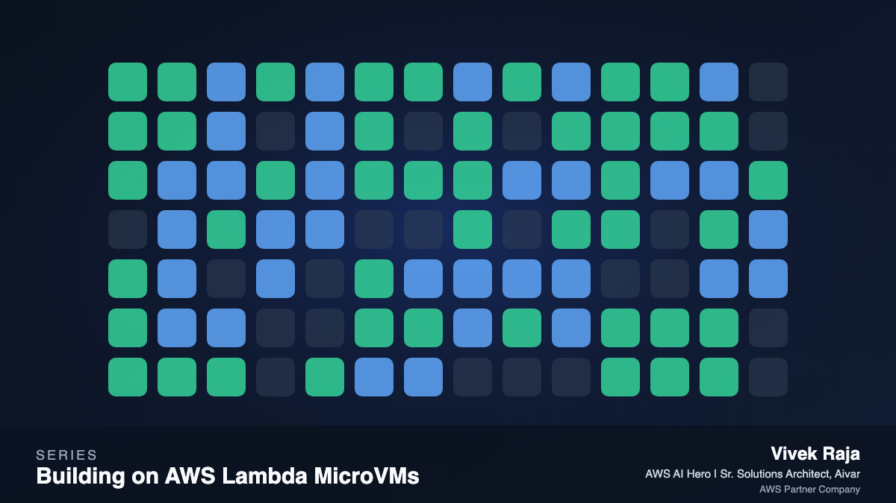

# awesome-microvm

Everything we have built, measured, and written about [AWS Lambda MicroVMs](https://docs.aws.amazon.com/lambda/latest/dg/lambda-microvms-guide.html): eight production-shaped example apps, the nine-part article series **Building on AWS Lambda MicroVMs**, and the recorded transcripts and benchmark results behind every number. All of it runs on [microvm-ctl](https://github.com/Vivek0712/microvm-ctl), our open-source control and execution plane for the service.



Lambda MicroVMs hands you a Firecracker VM with a controllable lifecycle (run, suspend with billing stopped and state frozen, resume with the same PID and every byte intact, terminate) and a dedicated authenticated endpoint. What you build on that primitive is the interesting part. This repo is the gallery.

## Get started

```console
pip install microvm-ctl
mvm bootstrap                  # one time: S3 artifact bucket + IAM roles
mvm image build code-sandbox examples/code-sandbox
mvm run code-sandbox --wait
mvm call <microvm-id> /execute -X POST -d '{"code":"print(2+2)"}'
```

## The use cases

Each example is a Dockerfile plus a single-file app on the plane's zero-dependency hook runtime, deployed and exercised on the live service. Every transcript linked below is a real recording.

| Example | Pattern | What it shows | Article |
|---|---|---|---|
| [code-sandbox](examples/code-sandbox) | sandbox | Untrusted or AI-written Python; state persists across calls | [part 2](blog/01-code-sandbox.md) |
| [ai-code-runner](examples/ai-code-runner) | agent in VM | Bedrock writes code, the VM runs it, tracebacks drive a self-repair loop | [part 3](blog/02-ai-code-runner.md) |
| [agent-eval](examples/agent-eval) | fan-out | N pristine clones, one eval task each, scoreboard, drain | [part 4](blog/03-agent-eval.md) |
| [notebook](examples/notebook) | stateful session | Variables survive suspend and resume, same PID | [part 5](blog/04-notebook.md) |
| [data-analytics](examples/data-analytics) | large working set | Sandboxed DuckDB over S3; bulk data stays off the endpoint | [part 6](blog/05-data-analytics.md) |
| [ci-runner](examples/ci-runner) | ephemeral job | Clone, test, terminate; per-second billing | [part 7](blog/06-ci-runner.md) |
| [pdf-service](examples/pdf-service) | bursty service | Untrusted HTML to PDF; sleeps between bursts | [part 8](blog/07-pdf-service.md) |
| [multi-tenant-agents](examples/multi-tenant-agents) | VM per tenant | Tenant identity via runHookPayload, near-zero idle cost | [part 9](blog/08-multi-tenant-agents.md) |

## The article series

Start with part 1, [Control and scale AWS Lambda MicroVMs with microvm-ctl](blog/00-control-and-scale-microvms-like-a-pro.md), then the eight use-case articles linked above. The house rule for the series: every number is measured on the live service, and every gotcha is one we hit. The articles are written for the AWS Builder Center; see [blog/README.md](blog/README.md) for the publishing checklist, series metadata, and cover images.

Headline measurements in us-east-1, reproducible with the plane's [benchmark harness](https://github.com/Vivek0712/microvm-ctl/blob/main/benchmarks/benchmark.py):

| What | Measured |
|---|---|
| Image build, Dockerfile to runnable snapshot | 123 to 145 s |
| RunMicrovm to serving authenticated traffic | p50 3.54 s, p95 4.49 s |
| Warm authenticated request, real Python execution in the VM | p50 111 ms |
| Suspend / resume | 2.5 s / 2.6 s, same PID, state intact |
| Auto-resume, first request to a suspended VM | 200 OK in 0.7 s |
| Fleet scale-out, 0 to 6 running VMs | 9.7 s wall |
| 30 min active + 8 h suspended session | 93.8% cheaper than always-on |


Raw results and SVG terminal transcripts are in [benchmarks/results/](benchmarks/results/). The recorder that produced them is [benchmarks/capture_demos.py](benchmarks/capture_demos.py). PNG renders of every transcript, diagram, and cover live in [blog/img/](blog/img/).

## Repo layout

```
examples/       8 runnable use cases (Dockerfile + single-file app each)
blog/           the 9-part series, Builder Center ready, plus blog/img/ assets
benchmarks/     capture_demos.py + recorded results (JSON, SVG transcripts, a rendered PDF)
```

The plane itself (SDK, mvm CLI, quota-aware fleet manager, endpoint client, hook runtime, docs) lives in [microvm-ctl](https://github.com/Vivek0712/microvm-ctl) under Apache-2.0.

## Credits and inspiration

The whole effort started from [lambda-microvm-starter](https://github.com/vidanov/lambda-microvm-starter) by [Alexey Vidanov](https://github.com/vidanov): one command to take any Dockerfile to a running Firecracker microVM with a public CloudFront URL, plus a troubleshooting guide that saved us a week. If you want to deploy a web app to a MicroVM today, start there. This repo and microvm-ctl pick up where it leaves off, with fleets, tokens, quotas, cost, and workload-shaped examples.

## License

MIT for the examples and content. The plane is Apache-2.0 in its own repo.
