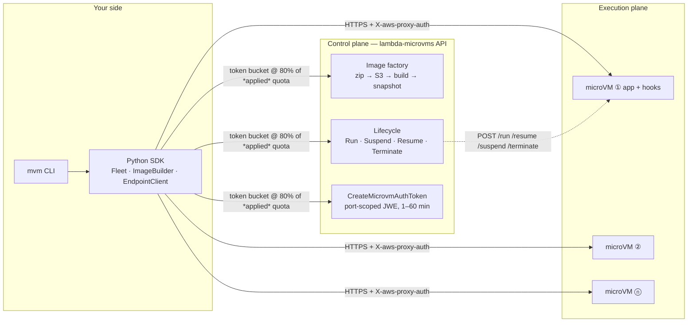

# Control and scale AWS Lambda MicroVMs like a pro

*A production control & execution plane for Firecracker microVMs: images, fleets, tokens, suspend economics, and the quota walls nobody tells you about — everything measured on the live service.*

AWS Lambda MicroVMs hands you the primitive that has been running under Lambda for eight years — a Firecracker VM — with the controls exposed: run it, suspend it, resume it with every byte of memory intact, terminate it. What it doesn't hand you is everything around that primitive: there is no load balancer (one HTTPS endpoint per VM), no fleet abstraction, no token management, no monitoring view, and the account you start with enforces quotas far below the published defaults.

We built [awesome-microvm](https://github.com/vivekrajaps/awesome-microvm), an open-source control & execution plane that fills that gap, deployed it against the live service in `us-east-1`, and measured everything. The headline numbers, all reproducible with the benchmark harness in the repo:

| What | Measured |
|---|---|
| Image build (Dockerfile → runnable snapshot) | 123–145 s |
| RunMicrovm → serving authenticated traffic | **p50 4.65 s**, best 3.50 s |
| Warm authenticated request (real Python exec inside VM) | **p50 119 ms** |
| Explicit suspend / resume | 2.4 s / 2.6 s — **same PID, all state intact** |
| Auto-resume (first request to a suspended VM) | **200 OK in 0.7 s** |
| 30 min active + 8 h suspended session | **93% cheaper** than always-on |

## Why a control plane at all

The service API is deliberately minimal: `RunMicrovm`, `SuspendMicrovm`, `ResumeMicrovm`, `TerminateMicrovm`, image CRUD, and token minting. Four realities turn that into an engineering project:

1. **One endpoint per VM.** Horizontal scale is literally more `RunMicrovm` calls, and routing across the fleet is your job.
2. **Every mutating call is rate-limited** — and on a fresh account, the *applied* quota is not the published one. We measured `RunMicrovm` at **1 request/second** (published default: 5/s) and total microVM memory at **8 GB** (published default: 1,024 GB).
3. **No unauthenticated path exists.** Every request into a VM needs a port-scoped, expiring JWE token in the `X-aws-proxy-auth` header, minted through an IAM-authenticated API.
4. **The lifecycle is event-driven from inside the VM** — your app must serve six HTTP hooks (`/ready`, `/validate`, `/run`, `/resume`, `/suspend`, `/terminate`) or builds fail and clones misbehave.

## Architecture



The design splits cleanly into a **control plane** (talks SigV4 to the service API) and an **execution plane** (talks HTTPS to each VM's endpoint). Nothing in the execution plane holds AWS credentials beyond token minting, and nothing in the control plane touches workload data.

## From zero to a serving VM in four commands

```console
$ mvm bootstrap                     # S3 artifact bucket + build/execution IAM roles
$ mvm image build code-sandbox examples/code-sandbox
✓ code-sandbox:1.0 (123.4s)
  memory snapshot: 609 MB   disk snapshot: 22 MB
$ mvm run code-sandbox --wait
✓ microvm-678f74f3-…  PENDING  dcd0032c-….lambda-microvm.us-east-1.on.aws
  now RUNNING
$ mvm call microvm-678f74f3-… /execute -X POST -d '{"code":"print(2+2)"}'
200 in 697 ms
```

What happened under `image build` matters: Lambda boots a *fresh* microVM, executes your Dockerfile on it, starts your ENTRYPOINT, waits for your app to answer `200` on `/ready`, and **snapshots memory and disk at that instant**. Every future `run` clones that snapshot — imports done, caches hot, process already alive. That is why a 609 MB memory image serves traffic 4 seconds after the API call instead of 40.

The builder also injects our zero-dependency hook server (`microvm_hooks.py`, stdlib only) into every image, so an app declares its lifecycle in decorators:

```python
from microvm_hooks import HookApp
app = HookApp()

@app.on_ready
def ready(ctx):          # 200 here == "snapshot me now"
    warm_caches(); return True

@app.on_run
def run(ctx):            # every clone, before traffic; RNG reseeded for you
    load_tenant(ctx.get("runHookPayload"))

@app.route("POST", "/execute")
def execute(body, headers):
    return 200, {"out": sandbox_exec(body["code"])}

app.serve(port=8080)
```

## Fleets: scale up, scale down, don't get throttled

```python
fleet = Fleet(FleetManager(cfg), "code-sandbox")
fleet.scale_to(20, wait_running=True)
fleet.suspend_all()          # park: snapshot-storage billing only
fleet.drain()                # terminate everything
```

`FleetManager` reads your account's **applied** quotas from Service Quotas at startup and throttles every mutating call through a token bucket at 80% of the real rate, with jittered exponential backoff behind it. On our fresh account that meant honoring 1 launch/second instead of naively assuming 5 — the difference between a clean scale-out and a wall of `ThrottlingException`.

Scale-down logic is opinionated, and the reasons are billing-shaped: suspended VMs are terminated first (they cost only storage but **still consume the regional memory quota**), then the youngest running VMs — the oldest hold the warmest state.


## The suspend/resume magic, verified

We ran 21 executions against a sandbox VM, wrote a marker file, then suspended it. Compute billing stopped. On resume:

```
before suspend: pid=1 executions=21 files=['marker.txt']
suspend 2.4s · resume-to-serving 2.6s · pid 1 → 1 · STATE PRESERVED
```

Same PID. Same process. Counter intact, file intact. Then we suspended it again and — without calling `ResumeMicrovm` at all — just sent it a request: **200 OK in 0.7 seconds.** The `EndpointClient` treats `502` as "possibly mid-resume" and retries patiently, so callers never learn the VM was asleep.

This is the economic engine of the whole service. Our cost model (rates in the repo, `mvm cost`):

| Session shape (2 GB / 1 vCPU) | Cost | vs. always-on |
|---|---|---|
| 8-second one-shot job, terminate | ~$0.0005 | — |
| 30 min active + 8 h suspended | $0.0755 | $1.07 → **93% saved** |
| Running 24/7 | ~$3.03/day | the shape where you should use Fargate instead |

Two honest caveats the pricing page won't emphasize: a suspend/resume cycle on our 0.61 GB snapshot costs ~$0.0034 in snapshot write+read — **cycling isn't free**, so one-shot jobs should terminate, not suspend. And idle detection keys off *endpoint traffic*: an async agent that goes quiet mid-task will be suspended mid-task unless you disable auto-suspend or heartbeat.

## The quota walls (we hit both so you don't have to)

Fresh accounts run a reduced profile. Ours: **8 GB total microVM memory** and **1 RunMicrovm/second**. Two non-obvious things count against that memory quota:

1. **Image-build VMs.** Kicking off five concurrent 2 GB builds consumed 10 GB of a quota we didn't have — `ServiceQuotaExceededException` on the next launch.
2. **TERMINATING VMs.** For a short window after `TerminateMicrovm`, the memory is still allocated. Fast churn tests must let terminations settle.

Both lessons are now encoded in the plane: quota-aware throttling, settle-waits in the benchmark harness, and `scale_to` preferring to kill suspended members first. Our RunMicrovm raise (1→5/s) was approved from a single `request-service-quota-increase` call. File yours on day one; treat quota headroom as a launch deliverable, not an afterthought.

## Monitoring: `mvm top`

A fleet you can't see is a bill you can't explain. `mvm top --watch` renders a live state-colored table of every VM (PENDING/RUNNING/SUSPENDED counts, per-VM age); `mvm logs <image>` tails the CloudWatch group the service writes (`/aws/lambda/microvms/<image>`, one stream per VM — build logs land there too, which is where you debug a failed Dockerfile); `mvm cost` prices a session shape before you commit to it.

## What we'd tell you before you build

- **Nothing secret in the image, ever.** Snapshots turn RAM into stored data, and env vars are image-level — shared by every clone. Per-VM context travels in `runHookPayload`; secrets come from the execution role inside `/run`.
- **`/validate` is a free cold-start optimizer.** It runs on a restored clone and Lambda prefetches the snapshot pages it touches. Exercise your hot path there.
- **Bulk data rides S3/EFS.** The endpoint is capped at 1–16 MB/s depending on VM size.
- **Cap everything at launch.** `maximumDurationInSeconds`, `suspendedDurationSeconds`, and a reaper. The 8-hour ceiling is hard; runaway agents are a launch-time config problem, not an invoice-time discovery.
- **ARM64 only.** Audit your wheels before you commit.

## The series

This plane exists to be built on. We shipped eight production-shaped examples on top of it, each with its own deep-dive post: a [code execution sandbox](01-code-sandbox.md), an [AI code runner with a self-repair loop](02-ai-code-runner.md), an [agent evaluation harness](03-agent-eval.md), a [stateful notebook kernel](04-notebook.md), [sandboxed data analytics](05-data-analytics.md), an [ephemeral CI runner](06-ci-runner.md), an [HTML-to-PDF service](07-pdf-service.md), and [multi-tenant AI agents](08-multi-tenant-agents.md).

Everything — the plane, the CLI, the examples, the benchmark harness that produced every number above — is in [github.com/vivekrajaps/awesome-microvm](https://github.com/vivekrajaps/awesome-microvm). `mvm bootstrap` and go.
