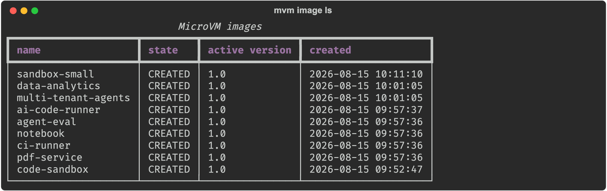
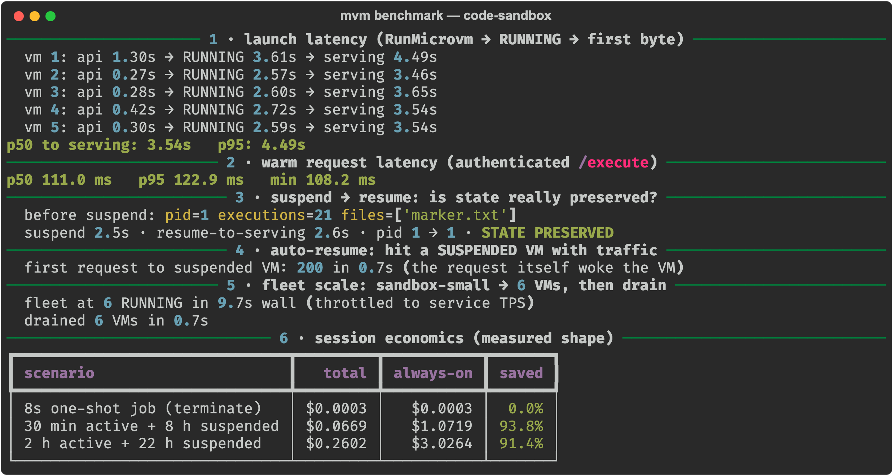
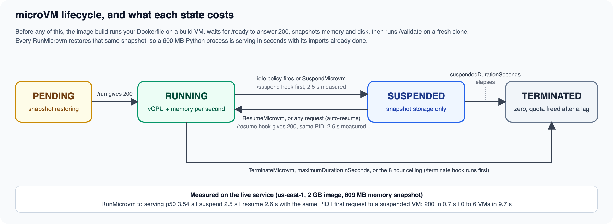
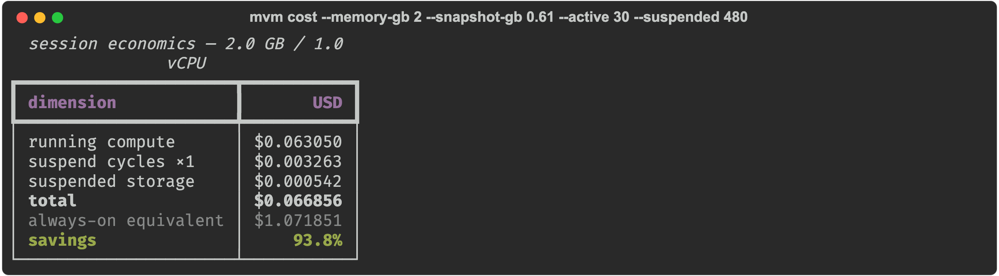

AWS Lambda MicroVMs hands you the primitive that has run under Lambda for eight years, a Firecracker VM, with the controls exposed. You can run it, suspend it, resume it with every byte of memory intact, and terminate it. The service stops there on purpose. There is no load balancer, because each VM gets its own HTTPS endpoint. There is no fleet abstraction, no token management, and no monitoring view, and a fresh account enforces quotas well below the published defaults.

I built [microvm-ctl](https://github.com/Vivek0712/microvm-ctl), an open-source control and execution plane that fills that gap (`pip install microvm-ctl`, [microvm-ctl on PyPI](https://pypi.org/project/microvm-ctl/)), deployed it against the live service in us-east-1, and measured everything. This article is part 1 of the series Building on AWS Lambda MicroVMs. Part 2 puts seven workloads on top of this plane, and part 3 builds the one that stresses every rule at once, a microVM per tenant, and closes with the decision guide.

A word on where this comes from. I am a Senior Solutions Architect at Aivar, an AWS Partner, and an AWS AI Hero. The workloads customers bring me increasingly need a real machine with Lambda ergonomics: untrusted code from a model, an agent that lives for hours, a database engine per user, a kernel per tenant. Lambda MicroVMs is the primitive for all of those, and the operational layer around it (images, fleets, tokens, quotas, cost) is the same every time. So I automated it once as microvm-ctl, ran each customer-shaped pattern on the live service as practice, and wrote down what I measured. This series is that work in the open, so the next customer conversation starts from numbers rather than guesses.

The headline numbers, all reproducible with the benchmark harness that ships in the package repo:

| What | Measured |
|---|---|
| Image build, Dockerfile to runnable snapshot | 123 to 145 s |
| RunMicrovm to serving authenticated traffic | p50 3.54 s, p95 4.49 s |
| Warm authenticated request, real Python execution inside the VM | p50 111 ms |
| Explicit suspend / resume | 2.5 s / 2.6 s, same PID, all state intact |
| First request to a suspended VM (auto-resume) | 200 OK in 0.7 s |
| Fleet scale-out, 0 to 6 running VMs | 9.7 s wall, drain in 0.7 s |
| 30 min active + 8 h suspended session | 93.8% cheaper than always-on |

## Why a control plane at all

The service API is small: RunMicrovm, SuspendMicrovm, ResumeMicrovm, TerminateMicrovm, image create and update, and token minting. Four properties of the service turn those calls into an engineering project.

1. One endpoint per VM. Horizontal scale means more RunMicrovm calls, and routing across the fleet is your job.
2. Every mutating call is rate limited, and on a fresh account the applied quota is lower than the published one. I measured RunMicrovm at 1 request per second (published default: 5) and total microVM memory at 8 GB (published default: 1,024 GB).
3. No unauthenticated path exists. Every request into a VM needs a port-scoped, expiring JWE token in the X-aws-proxy-auth header, minted through an IAM-authenticated API.
4. The lifecycle is event-driven from inside the VM. Your app must serve six HTTP hooks (/ready, /validate, /run, /resume, /suspend, /terminate), or builds fail and clones misbehave.

## Architecture


The design splits into a control plane that talks SigV4 to the service API and an execution plane that talks HTTPS to each VM's endpoint. Nothing in the execution plane holds AWS credentials beyond what token minting needs, and nothing in the control plane touches workload data.

## From zero to a serving VM in four commands

After the eight example images in this series are built, `mvm image ls` looks like this:



```console
$ mvm bootstrap                     # S3 artifact bucket + build/execution IAM roles
$ mvm image build code-sandbox examples/code-sandbox
✓ code-sandbox:1.0 (123.4s)
  memory snapshot: 609 MB   disk snapshot: 22 MB
$ mvm run code-sandbox --wait
✓ microvm-678f74f3-...  PENDING  dcd0032c-....lambda-microvm.us-east-1.on.aws
  now RUNNING
$ mvm call microvm-678f74f3-... /execute -X POST -d '{"code":"print(2+2)"}'
200 in 697 ms
```

The image build is where the launch speed comes from. Lambda boots a fresh microVM, executes your Dockerfile on it, starts your ENTRYPOINT, waits for your app to answer 200 on /ready, and snapshots memory and disk at that instant. Every future run restores that snapshot, so imports are done, caches are hot, and the process is already alive. A 609 MB memory image serves traffic four seconds after the API call for that reason.

The builder injects a zero-dependency hook server (microvm_hooks.py, standard library only) into every image, so an app declares its lifecycle in decorators:

```python
from microvm_hooks import HookApp
app = HookApp()

@app.on_ready
def ready(ctx):          # 200 here means "snapshot me now"
    warm_caches()
    return True

@app.on_run
def run(ctx):            # every clone, before traffic; RNG reseeded for you
    load_tenant(ctx.get("runHookPayload"))

@app.route("POST", "/execute")
def execute(body, headers):
    return 200, {"out": sandbox_exec(body["code"])}

app.serve(port=8080)
```

## Fleets: scale up, scale down, stay under the quota

```python
fleet = Fleet(FleetManager(cfg), "code-sandbox")
fleet.scale_to(20, wait_running=True)
fleet.suspend_all()          # park the fleet: snapshot storage billing only
fleet.drain()                # terminate everything
```

FleetManager reads your account's applied quotas from Service Quotas at startup and throttles every mutating call through a token bucket at 80% of the real rate, with jittered exponential backoff behind it. On my fresh account that meant honoring one launch per second instead of assuming five, which is the difference between a clean scale-out and a wall of ThrottlingException.

Scale-down has an opinion, and the reason is billing. Suspended VMs are terminated first, because they cost only storage but still hold regional memory quota. Then the youngest running VMs go, since the oldest hold the warmest state.

I measured the scale path end to end on that account. scale_to(6) took a fleet from zero to six RUNNING microVMs in 9.7 seconds of wall time, with every launch throttled to the applied one-per-second quota, and drain() terminated all six in 0.7 seconds.



## Suspend and resume, verified



I ran 21 executions against a sandbox VM, wrote a marker file, and suspended it. Compute billing stopped. On resume:

```
before suspend: pid=1 executions=21 files=['marker.txt']
suspend 2.5s, resume-to-serving 2.6s, pid 1 -> 1, STATE PRESERVED
```

Same PID, same process, counter intact, file intact. I then suspended it again and, without calling ResumeMicrovm at all, sent it a request. It answered 200 OK in 0.7 seconds. The EndpointClient treats a 502 as a possible mid-resume and retries patiently, so callers never learn the VM was asleep.

This is the economic engine of the whole service. My cost model uses the published rates and is available as `mvm cost`:

| Session shape (2 GB / 1 vCPU) | Cost | Always-on equivalent |
|---|---|---|
| 8 second one-shot job, terminate | $0.0003 | n/a |
| 30 min active + 8 h suspended | $0.0669 | $1.07, 93.8% saved |
| 2 h active + 22 h suspended | $0.2602 | $3.03, 91.4% saved |
| Running 24/7 | about $3.03 per day | the shape where Fargate wins |



Two caveats keep this honest. A suspend and resume cycle on my 0.61 GB snapshot costs about $0.0033 in snapshot write plus read, so one-shot jobs should terminate rather than suspend. And idle detection keys off endpoint traffic, so an asynchronous agent that goes quiet mid-task will be suspended mid-task unless you lengthen the idle window or send a heartbeat.

## The quota walls

Fresh accounts run a reduced profile. Mine had 8 GB of total microVM memory and one RunMicrovm per second. Two things count against that memory quota that you might not expect:

1. Image-build VMs. Five concurrent 2 GB builds consumed 10 GB of a quota I did not have, and the next launch failed with ServiceQuotaExceededException.
2. TERMINATING VMs. For a short window after TerminateMicrovm the memory is still allocated, so fast churn tests must let terminations settle.

Both lessons are now encoded in the plane: quota-aware throttling, settle-waits in the benchmark harness, and a scale_to that terminates suspended members first. I filed a RunMicrovm raise from one to five per second with a single request-service-quota-increase call. The case closed with the applied value unchanged, so every fleet number in this series was produced at one launch per second. File yours on day one and treat quota headroom as a launch deliverable.

`mvm quotas` prints the published default, the applied value, and the rate the plane will throttle at, so you can see this before you plan a fleet. This is my account:


## Monitoring

`mvm top --watch` renders a live state-colored table of every VM with per-state counts and per-VM age. `mvm logs <image>` tails the CloudWatch group the service writes, /aws/lambda/microvms/<image>, one stream per VM. Build logs land there too, which is where you debug a failed Dockerfile. `mvm cost` prices a session shape before you commit to it.

## What I would tell you before you build

- Nothing secret goes in the image. Snapshots turn RAM into stored data, and environment variables are image-level, shared by every clone. Per-VM context travels in runHookPayload; secrets come from the execution role inside /run.
- /validate is a free cold-start optimizer. It runs on a restored clone and Lambda prefetches the snapshot pages it touches. Exercise your hot path there.
- Bulk data rides S3 or EFS. The endpoint is capped at 1 to 16 MB/s depending on VM size.
- Cap everything at launch: maximumDurationInSeconds, suspendedDurationSeconds, and a reaper. The 8 hour ceiling is hard. Runaway agents are a launch-time configuration problem.
- The VMs are ARM64 only. Audit your wheels before you commit to a dependency.

## The series

This plane exists to be built on. Part 2 of Building on AWS Lambda MicroVMs takes seven workloads through build, run, cost, and gotchas with measured numbers: a code execution sandbox, an AI code runner with a self-repair loop, an agent evaluation fleet, a stateful notebook kernel, sandboxed DuckDB analytics, an ephemeral CI runner, and an HTML to PDF service. Part 3 builds multi-tenant AI agents with one microVM per tenant and distills the whole series into a decision guide.

Credit where it is due: Alexey Vidanov's [lambda-microvm-starter](https://github.com/vidanov/lambda-microvm-starter) was my first working map of the service. It deploys any Dockerfile to a MicroVM behind a public CloudFront URL in one command, and its troubleshooting guide documented several of the gotchas above before I hit them. If your goal is one web app on a MicroVM, start there; this series is about what comes after.

The plane itself (SDK, mvm CLI, hook runtime, benchmark harness) is [microvm-ctl](https://github.com/Vivek0712/microvm-ctl), Apache-2.0, published as [microvm-ctl on PyPI](https://pypi.org/project/microvm-ctl/). The eight examples, this series, the longer write-up of each workload, and every recorded transcript live in [awesome-microvm](https://github.com/Vivek0712/awesome-microvm); the code for each example is under `examples/` there.

```console
pip install microvm-ctl
mvm bootstrap
```
