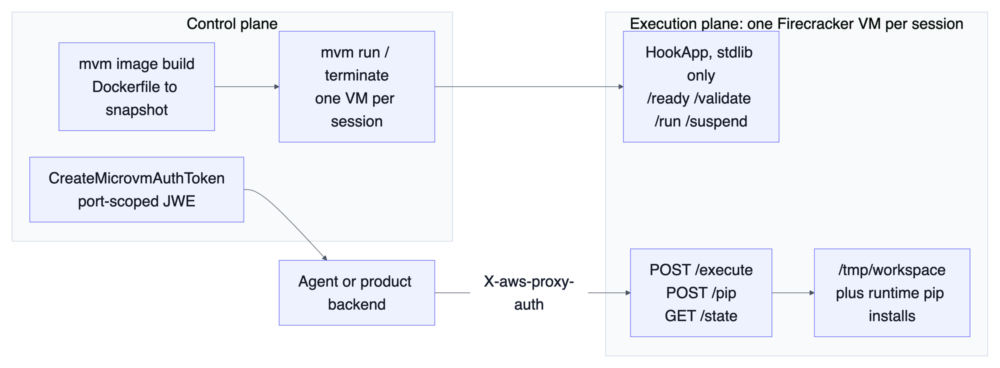
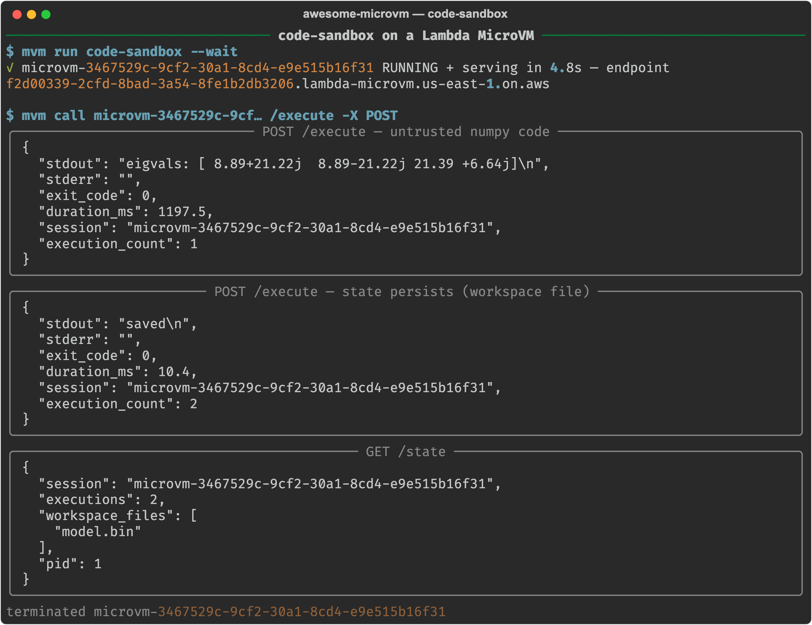
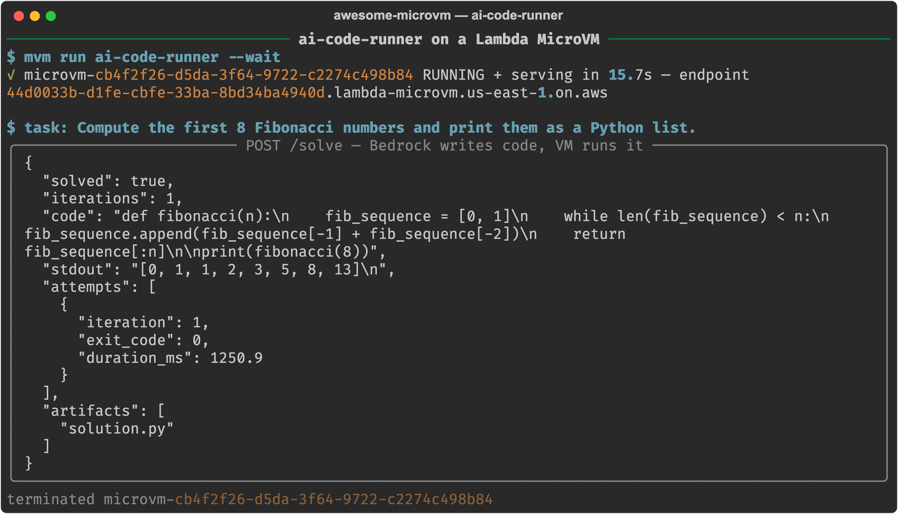
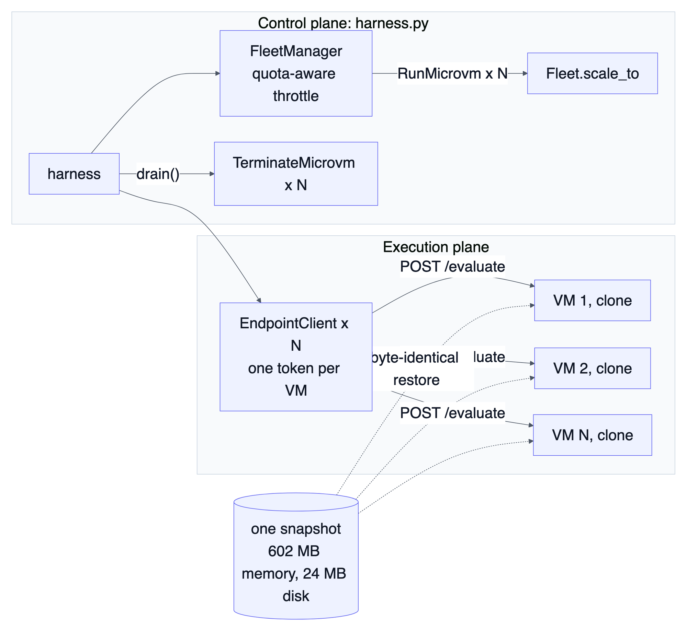
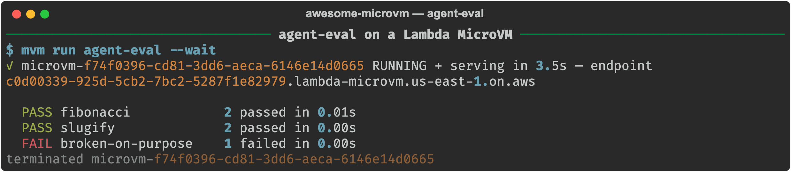
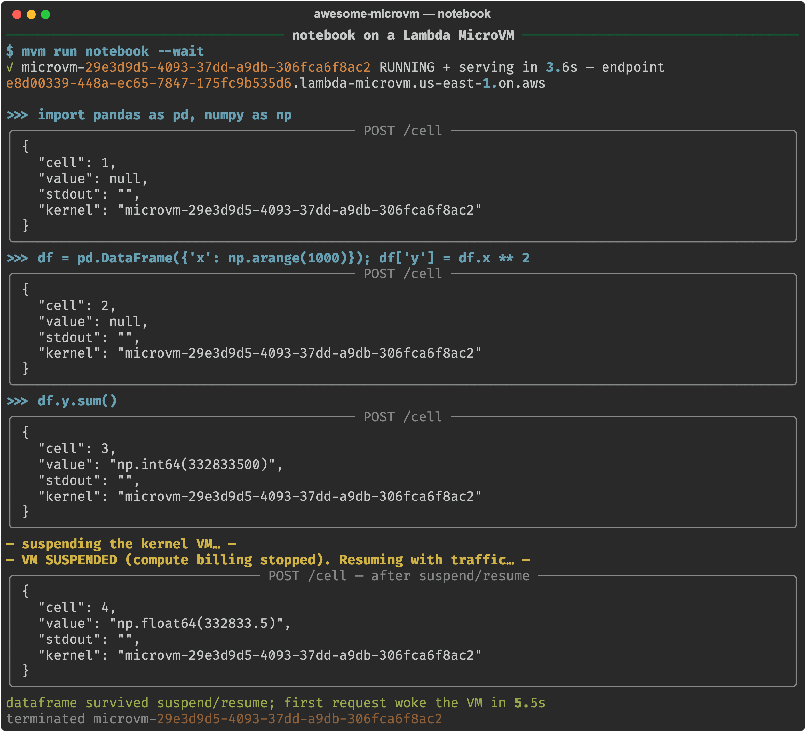
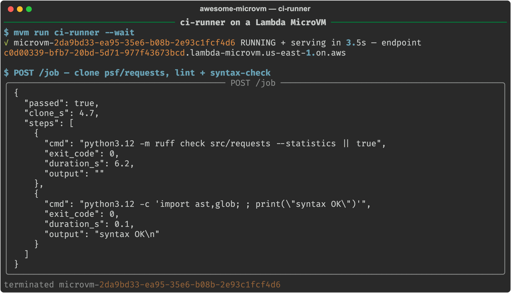
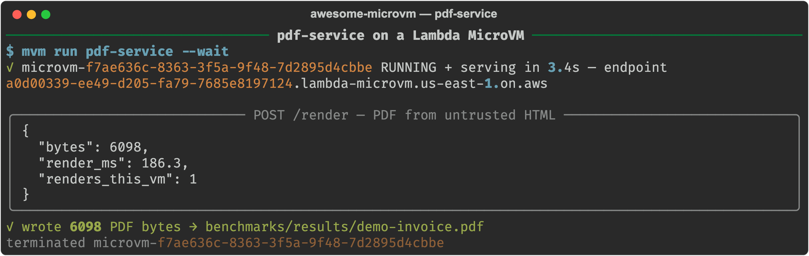

Part 1 of this series built [microvm-ctl](https://github.com/Vivek0712/microvm-ctl), a control and execution plane for AWS Lambda MicroVMs, and measured the primitive: p50 3.54 s from RunMicrovm to serving authenticated traffic, 111 ms warm requests, suspend and resume with the same PID, and a 93.8% saving on a bursty session. This part puts seven workloads on top of it, and every one of them was out of reach for a Lambda function until now: they need a persistent filesystem, a process that outlives a request, a kernel boundary around untrusted code, or a working set that stays loaded between calls. They are the seven shapes customers ask me about most often in my work as a Solutions Architect at Aivar, so I built each one as a reference I can hand over. Each one is a Dockerfile plus a single-file app, deployed and exercised on the live service in us-east-1, and each transcript below is a real recording.

The code for every example is in the [awesome-microvm repository](https://github.com/Vivek0712/awesome-microvm) under `examples/`, and each section links to its directory. Longer write-ups of each workload live in the same repo under `blog/deep-dives/`.

## What the seven have in common

Every app declares its lifecycle with the same zero-dependency hook server that the image builder injects as microvm_hooks.py. The service calls the hooks over HTTP, and the app answers:

| Hook | When | What the examples do there |
|---|---|---|
| /ready | on the build VM, before the snapshot | import the heavy libraries so every clone wakes warm |
| /validate | on a fresh clone of the new snapshot | run the hot path once so the service prefetches those pages |
| /run | on every launched clone, before traffic | create identity, parse runHookPayload, build AWS clients |
| /resume | after a suspended VM wakes | rebuild connections and refresh credentials |

Three rules recur in every section. Uniqueness and secrets are created in /run, never at build time, because the snapshot is a photocopy. Bulk data moves over S3 with the execution role, because the endpoint is bandwidth-capped at 1 to 16 MB/s. And the lifecycle choice is per workload: sessions suspend, one-shot jobs terminate.

| Workload | Pattern | Lifecycle | Directory |
|---|---|---|---|
| Code sandbox | one VM per session | suspend between calls, terminate at end | [examples/code-sandbox](https://github.com/Vivek0712/awesome-microvm/tree/main/examples/code-sandbox) |
| AI code runner | agent loop inside the VM | suspend while the human thinks | [examples/ai-code-runner](https://github.com/Vivek0712/awesome-microvm/tree/main/examples/ai-code-runner) |
| Agent eval fleet | N identical clones | terminate, never suspend | [examples/agent-eval](https://github.com/Vivek0712/awesome-microvm/tree/main/examples/agent-eval) |
| Notebook kernel | stateful session | suspend for hours | [examples/notebook](https://github.com/Vivek0712/awesome-microvm/tree/main/examples/notebook) |
| DuckDB analytics | large working set | suspend between bursts | [examples/data-analytics](https://github.com/Vivek0712/awesome-microvm/tree/main/examples/data-analytics) |
| CI runner | ephemeral job | terminate on report | [examples/ci-runner](https://github.com/Vivek0712/awesome-microvm/tree/main/examples/ci-runner) |
| HTML to PDF | bursty internal service | suspend between bursts | [examples/pdf-service](https://github.com/Vivek0712/awesome-microvm/tree/main/examples/pdf-service) |

## 1. A code execution sandbox

Every AI product that runs model-generated code needs a hardware-isolated VM per session with a filesystem and pip environment that persist between calls. Containers share the host kernel and a seccomp profile is a filter rather than a wall. A Lambda function cannot promise a per-session filesystem across invocations. A microVM is yours until you terminate it.



The image is a 13-line Dockerfile with numpy and pandas baked in, and the app wires four hooks. The two that matter most:

```python
@app.on_validate
def validate(_ctx):
    # Exercise the hot path on a fresh VM so Lambda prefetches these snapshot regions.
    _run_code("import numpy, pandas; print(numpy.zeros(4).sum())", 20)

@app.on_run
def on_run(ctx):
    # Fresh identity per clone. Anything build-time is shared by every VM.
    SESSION["id"] = ctx.get("microvmId") or str(uuid.uuid4())
    SESSION["executions"] = 0
```

/execute runs code as a subprocess with a per-call timeout, /pip installs a library mid-session, and /state reports the session ID, execution count, and workspace contents.



The VM was serving 4.8 s after `mvm run`. The first execution, untrusted numpy eigenvalue code, took 1,197.5 ms including a cold subprocess spawn. The second wrote a file to the workspace in 10.4 ms. GET /state shows the same session ID, two executions, the file present, and PID 1. Across 20 warm samples the end-to-end request latency was p50 111.0 ms and p95 122.9 ms, including TLS, proxy auth, and the Python subprocess.

The lesson from this one: terminate one-shots and suspend conversations. A suspend and resume cycle on the 0.61 GB snapshot costs about $0.0033 in snapshot I/O, more than ten times the compute cost of an 8 second job.

## 2. An AI code runner with a self-repair loop

The sandbox becomes an agent when the model is inside the loop. Bedrock writes a script, the VM runs it, and if it exits non-zero the traceback goes straight back to the model:

```python
for i in range(int(body.get("max_iterations", 3))):
    code = _generate(messages)          # Bedrock converse(), nova-lite
    result = _execute(code)             # python3.12 solution.py, 60 s timeout
    if result["exit_code"] == 0:
        return 200, {"solved": True, "iterations": i + 1, "code": code,
                     "stdout": result["stdout"], "artifacts": sorted(os.listdir(WORKSPACE))}
    messages.append({"role": "assistant", "content": [{"text": code}]})
    messages.append({"role": "user", "content": [
        {"text": f"That failed:\n{result['stderr'][-3000:]}\nFix it. Full script only."}]})
```

There is no sandboxing inside the VM, no import allowlist, and no seccomp work. The VM boundary is the sandbox. If the model writes shutil.rmtree("/"), it destroys a Firecracker VM I was going to terminate anyway.

The design constraint is the snapshot. The Bedrock client is created in /run, never at import time, so its credentials come from the VM's execution role rather than from a variable frozen into 608 MB of cloned RAM. /resume creates it again, because TCP connections do not survive the freeze.



The task "Compute the first 8 Fibonacci numbers and print them as a Python list" was solved in one iteration, with the subprocess running in 1,250.9 ms. An earlier capture launched without the execution role failed instantly with NoCredentialsError from inside the VM, which is the design working: there was no key anywhere in the image to fall back on.

## 3. An agent evaluation fleet

Contamination ruins eval pipelines quietly. Task 47 installs a package, task 48 inherits it and passes tests it should have failed. Every VM launched from an image is a restored copy of the same memory-and-disk snapshot, which is stronger than "same Dockerfile, rebuilt"; it is the same bytes.



The harness is where the fleet mechanics live. Scale-out is one call, with a hard lifetime cap because eval fleets are disposable by construction:

```python
fleet = Fleet(
    FleetManager(cfg), args.image,
    idle_policy=IdlePolicy(max_idle=600, suspended_for=60, auto_resume=False),
    max_duration=3600,
)
fleet.scale_to(args.workers, wait_running=True)
clients = [EndpointClient(cfg, vm.microvm_id) for vm in fleet.members()]
```

Tasks round-robin over the clients on a thread pool, each /evaluate wipes its workspace first, and fleet.drain() terminates everything when the scoreboard prints. The task suite ships a canary that is wrong on purpose, because an eval harness that has never been seen to fail is one you cannot trust.



The scoreboard reads exactly as the tasks predict: PASS fibonacci, PASS slugify, FAIL broken-on-purpose. On the fleet path, scale_to(6) took a fresh fleet from 0 to 6 RUNNING microVMs in 9.7 s wall with every launch throttled to the account's applied 1 per second quota, and drain() terminated all six in 0.7 s.

Eval workers terminate rather than suspend. A worker has no state worth $0.0033 to preserve; its value is that the next run starts from the pristine snapshot.

## 4. A notebook kernel that suspends for free

Users think for hours and compute for seconds, but the kernel holding their variables must stay resident the whole time. A Lambda function is stateless by design. A container bills every second it exists, and stopping it destroys memory. A Lambda MicroVM suspends, and the namespace dict, the imported pandas module, and the DataFrame all survive without a byte of serialization code.

The kernel is a module-level dict and one route that does the REPL's eval-versus-exec dance:

```python
NS: dict = {}

@app.on_ready
def ready(_ctx):
    import numpy, pandas  # imported into the snapshot, warm for every clone
    return True

@app.route("POST", "/cell")
def cell(body, _headers):
    try:
        value = eval(compile(code, "<cell>", "eval"), NS)   # expression?
    except SyntaxError:
        exec(compile(code, "<cell>", "exec"), NS)           # statement
    ...
```



Cell 3 returns np.int64(332833500) from a 1,000-row DataFrame. I then suspend the VM, and without calling ResumeMicrovm I POST cell 4, a mean over the same DataFrame. It returns np.float64(332833.5) with the same kernel ID. In this capture the waking request completed in 5.5 s end to end; the dedicated benchmark measured a suspended VM answering its first request in 0.7 s.

Two run flags deserve thought for interactive sessions. `--idle` is how long the endpoint can go quiet before the service suspends the VM, and a user staring at a plot for six minutes is idle by that definition, so I set 900 s for humans. `--suspended-ttl` maps to suspendedDurationSeconds, which is an auto-terminate timer. Leave it at the default 3,600 s and a kernel suspended over a long lunch is destroyed, state and all.

## 5. Sandboxed DuckDB analytics

An LLM that writes SQL is an untrusted user with a keyboard. DuckDB will COPY to any path, read any file the process can see, and load extensions. Sanitizing the SQL does not contain that; the boundary around the process does. At the same time, analytics sessions are stateful: an analyst loads a parquet file once and asks it forty questions.


One rule makes the design work: bulk data never crosses the endpoint. DuckDB's httpfs extension reads s3:// URIs directly using the execution-role credentials, and only the SQL going in and the result set coming out (capped at 1,000 rows) touch the capped endpoint.

The hooks encode two snapshot rules. /ready opens the database and installs the S3 extensions so every clone wakes with them loaded. /run creates the S3 secret from the execution role, wrapped so it can never fail the hook, because a non-200 from /run terminates the VM and an engine without S3 access can still serve local queries:

```python
@app.on_run
def on_run(_ctx):
    try:
        _db.execute("CREATE OR REPLACE SECRET aws (TYPE s3, PROVIDER credential_chain);")
    except Exception as e:
        print(f"s3 secret setup skipped: {e}", flush=True)

@app.on_resume
def on_resume(ctx):
    on_run(ctx)  # role credentials rotate; refresh after resume
```


The first query in the transcript fails on a missing pytz module, and the engine returns it as a 400 JSON body and keeps serving, which is what you want when the SQL author is a model that will read the error and try again. The second query generates and aggregates one million rows into five buckets in 1,189.7 ms measured inside the VM, with the result crossing the endpoint as a few hundred bytes of JSON.

## 6. An ephemeral CI runner

Your self-hosted CI runner is the most trusted and least audited machine in your infrastructure, and it lives for weeks. Here every job executes in a VM no other job has ever touched, restored from a snapshot with the toolchain already installed.

The job is a shallow clone followed by whatever steps the dispatcher sends, and the launch carries a runaway cap:

```console
$ mvm run ci-runner --max-duration 900 --payload '{"repo_url": "...", "ref": "main"}' --wait
```

maximumDurationInSeconds is the control-plane guarantee that a hung test suite, a fork bomb in a malicious pull request, or a wedged clone cannot outlive its budget. The service terminates the VM for you.



The runner was serving 3.5 s after launch. It shallow-cloned psf/requests off the internet in 4.7 s, ran ruff across the source in 6.2 s, ran an ast-based syntax check in 0.1 s, and returned a passing report. About eleven seconds of useful work on a machine that did not exist fifteen seconds earlier and ceased to exist immediately after.

A 90 second test run on a 2 GB runner costs about $0.0043 including the snapshot restore. An always-on 2 GB runner costs about $3.03 per day whether it runs zero jobs or a hundred; you would need on the order of 700 jobs per day before it breaks even, and it still would not give you a clean machine per job.

## 7. An HTML to PDF service that sleeps between bursts

An HTML renderer is a parser for markup, CSS, images, and fonts, all attacker-controlled, and every one of those parsers has a CVE history. Add resource loading and an img tag pointing at 169.254.169.254 gives you SSRF. The service also gets used in bursts, end-of-month invoicing and the like, and sits idle the rest of the day.

WeasyPrint was chosen over headless Chromium because on this platform snapshot size is a performance and cost knob. The image snapshots at 660 MB; a Chromium tree would bloat it badly. The hooks do the microVM-specific work:

```python
@app.on_ready
def ready(_ctx):
    global HTML
    from weasyprint import HTML  # heavyweight import baked warm into the snapshot
    return True

@app.on_validate
def validate(_ctx):
    HTML(string="<h1>warmup</h1>").write_pdf()  # prefetch the render path
```

The handler passes base_url=None to refuse relative resource resolution, the first line of SSRF defense. The VM boundary is the second line, for the day a parser bug makes the first one irrelevant.



3.4 s from `mvm run` to serving, and 186.3 ms to render a 6,098-byte invoice on the first request to a fresh VM with no warmup tricks in the app. That number is the /ready and /validate work paying off. Between bursts the VM suspends and the next POST /render wakes it.

## What they cost

All seven run on 2 GB / 1 vCPU VMs with memory snapshots between 602 and 680 MB. Published us-east-1 rates, billed per second:

| Meter | Rate |
|---|---|
| vCPU | $0.0000276944 per vCPU-second |
| Memory | $0.0000036667 per GB-second |
| Snapshot write / read | $0.0038 / $0.00155 per GB |
| Suspended and image storage | $0.08 per GB-month |

From the cost model in microvm-ctl, on the measured 0.61 GB snapshot:

| Session shape | MicroVM | Always-on 2 GB | Saved | Which workloads |
|---|---|---|---|---|
| 8 s one-shot, terminate | $0.0003 | n/a | n/a | eval workers, CI jobs, one-shot sandboxes |
| 30 min active + 8 h suspended | $0.0669 | $1.0719 | 93.8% | notebooks, analytics, PDF bursts, coding sessions |
| 2 h active + 22 h suspended | $0.2602 | $3.0264 | 91.4% | heavy sessions |
| Running 24/7 | n/a | about $3.03 per day | n/a | the shape where Fargate wins |


## The gotchas, once

- The snapshot clones everything. RNG state, generated IDs, open connections, and any secret in memory at /ready time are copied into every VM. Create per-VM values in /run, deliver context through runHookPayload, and fetch secrets with the execution role. The hook server reseeds the RNG on /run for you.
- Image environment variables are shared by every clone, capped at 50, and need a rebuild to change. They are the wrong place for tenant IDs and secrets.
- Idle detection keys off endpoint traffic in both directions. A user reading results gets suspended; a frontend polling a health route keeps the VM billing forever.
- suspendedDurationSeconds is a self-destruct timer, and total lifetime is capped at 8 hours. Size the TTL to the longest absence you want to survive and have an export story.
- Resumed connections are dead. Rebuild clients in /resume, and refresh credentials there because role credentials rotate while the VM sleeps.
- A non-200 from /run terminates the VM. Wrap best-effort setup.
- The endpoint is bandwidth-capped at 1 to 16 MB/s by VM size. Bulk data rides S3 or EFS.
- The applied memory quota on a fresh account was 8 GB (published default: 1,024 GB) and it counts RUNNING, SUSPENDED, TERMINATING, and image-build VMs. My RunMicrovm rate was 1 per second (published default: 5). The plane throttles to 80% of applied values; file raises on day one.
- The VMs are ARM64 only. Audit binary wheels before you depend on a package.

## Where to go from here

Every example is a starting point rather than a product. The obvious next steps are wiring the CI runner to a webhook, checkpointing notebook and analytics state to S3 in the /suspend hook so the 8 hour ceiling stops mattering, pre-warming a small fleet ahead of a burst, and swapping the DuckDB engine for chDB. The code is in [awesome-microvm](https://github.com/Vivek0712/awesome-microvm), and the plane is [microvm-ctl](https://github.com/Vivek0712/microvm-ctl), installable from [microvm-ctl on PyPI](https://pypi.org/project/microvm-ctl/) with `pip install microvm-ctl`.

Part 3 takes the pattern that ties all seven together, identity injected at launch through runHookPayload, and builds the one workload that stresses it hardest: one microVM per tenant, running a private AI agent for each customer.
