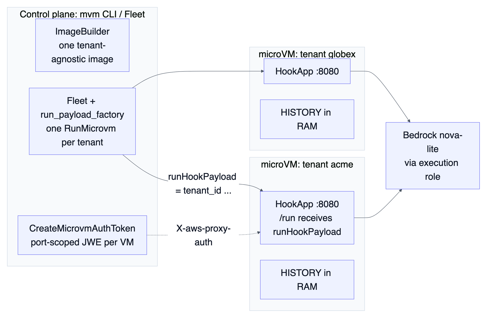
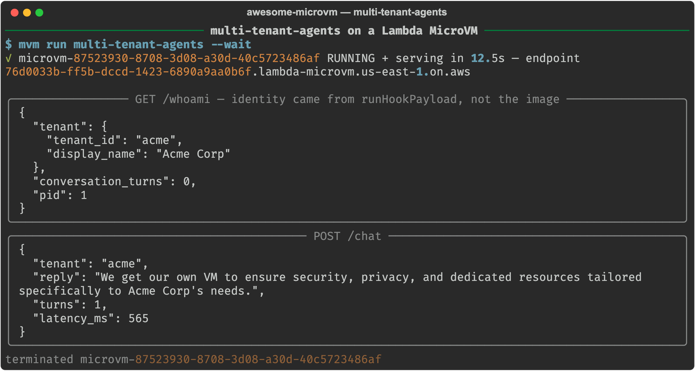

Every ISV building an AI assistant hits the same fork. Tenant Acme's conversation history, credentials, and prompts must never be reachable from tenant Globex's process, and the usual answer is a Kubernetes-shaped platform with namespaces, network policies, and row-level security, plus a node pool that bills around the clock for tenants who are asleep. Of everything in this series, this is the question ISV customers put to me most often at Aivar, and it is the one I now answer with a demo rather than a diagram. This article takes the blunt approach: one Firecracker microVM per tenant. Acme gets a kernel. Globex gets a different kernel. The bill stays sane because a tenant who is not talking costs snapshot storage only.

This is the final part of the series Building on AWS Lambda MicroVMs. Part 1 built the control plane, [microvm-ctl](https://github.com/Vivek0712/microvm-ctl), and part 2 put seven workloads on it. This one builds the workload that stresses every rule from the first two parts at once, and closes with the decision guide I wish I had on day one. Everything here was run against the live service in us-east-1. The code is in the [awesome-microvm repository](https://github.com/Vivek0712/awesome-microvm) under [examples/multi-tenant-agents](https://github.com/Vivek0712/awesome-microvm/tree/main/examples/multi-tenant-agents).

## Why a microVM and not a container or a Lambda function

A container per tenant shares the host kernel with every other tenant. Namespaces and cgroups are a resource boundary rather than a security boundary, and a multi-tenant AI product is precisely the workload where a hostile tenant gets to type inputs into your process all day. A Firecracker microVM gives each tenant the boundary AWS itself uses to separate Lambda customers.

A Lambda function per tenant has the isolation but not the state. A conversation is stateful: history, a warm Bedrock client, whatever the tenant uploaded. Lambda's short stateless invocations force all of that out to a database on every turn. A microVM holds it in RAM and suspends with it.

A dedicated container or EC2 instance per tenant has both, but bills around the clock. An always-on 2 GB VM shape costs about $3.03 per day, and most tenants are idle most of the day. MicroVMs launch to serving authenticated traffic in p50 3.54 s, suspend in 2.5 s, and auto-resume on the tenant's next request in 0.7 s, so being off when idle is invisible to the tenant.

## Architecture



There is exactly one image, and it knows nothing about any tenant. The control plane launches one VM per tenant and injects identity at run time through runHookPayload. Each VM gets its own dedicated HTTPS endpoint, so there is no shared load balancer to misroute a request, and calls Bedrock through the VM's execution role. Tokens are port-scoped JWEs minted per VM, so an Acme token is useless against Globex's endpoint.

## Build it

The Dockerfile is plain, and that is the point. Nothing tenant-specific may exist at build time, because the build produces a snapshot that every clone starts from:

```dockerfile
FROM public.ecr.aws/lambda/microvms:al2023-minimal

RUN dnf install -y python3.12 python3.12-pip && dnf clean all
RUN python3.12 -m pip install --no-cache-dir boto3

WORKDIR /app
COPY microvm_hooks.py app.py /app/

EXPOSE 8080
ENTRYPOINT ["python3.12", "/app/app.py"]
```

Building it takes 123.2 s and yields a 604 MB memory snapshot plus 23 MB of disk.

The anti-pattern comes first, because it is the first thing everyone reaches for: do not put per-tenant values in image environment variables. They are image-level, set once at build, capped at 50, shared by every clone launched from that image, and persisted into the snapshot. TENANT_ID=acme as an environment variable means every tenant is Acme, forever, and rotating it means rebuilding the image. The service gives you a per-launch channel instead: runHookPayload, a string handed to RunMicrovm and delivered to the VM's /run hook. That is where identity belongs:

```python
TENANT: dict = {}
HISTORY: list[dict] = []
_bedrock = None

@app.on_run
def on_run(ctx):
    global _bedrock
    payload = ctx.get("runHookPayload")
    TENANT.update(json.loads(payload) if payload else {"tenant_id": "unassigned"})
    import boto3
    _bedrock = boto3.client("bedrock-runtime", region_name=os.environ.get("AWS_REGION", "us-east-1"))
```

The same run-time rule covers credentials. There is no Bedrock key in the image. The client picks up the execution role attached to RunMicrovm, so each tenant's VM can carry its own scoped role.

Conversation memory is a module-level list. /chat appends the user turn, calls converse with the last 20 messages and a per-tenant system prompt, and appends the reply:

```python
HISTORY.append({"role": "user", "content": [{"text": msg}]})
resp = _bedrock.converse(
    modelId=MODEL,
    messages=HISTORY[-20:],
    system=[{"text": f"You are the private assistant of tenant "
                     f"{TENANT.get('display_name') or TENANT.get('tenant_id')}. Be concise."}],
    inferenceConfig={"maxTokens": 500},
)
```

No database. When the idle policy suspends the VM, the snapshot captures the memory of every process, HISTORY included. My suspend and resume fidelity run measured PID 1 before suspend and PID 1 after resume, which is why /whoami reports its pid: it is the tenant-visible proof that the conversation never left RAM. The one thing that does not survive the freeze is TCP, so the resume hook rebuilds the client:

```python
@app.on_resume
def on_resume(ctx):
    global _bedrock
    import boto3  # refresh clients; pre-suspend connections may be stale
    _bedrock = boto3.client("bedrock-runtime", region_name=os.environ.get("AWS_REGION", "us-east-1"))
```

Launching the fleet is one Fleet with a run_payload_factory, a callable that maps a member index to that VM's payload:

```python
tenants = [("acme", "Acme Corp"), ("globex", "Globex"), ("initech", "Initech")]

fleet = Fleet(
    manager=manager,                      # cfg carries execution_role_arn
    image="multi-tenant-agents",
    idle_policy=IdlePolicy(max_idle=300, suspended_for=7200),
    run_payload_factory=lambda i: json.dumps(
        {"tenant_id": tenants[i][0], "display_name": tenants[i][1]}
    ),
)
fleet.scale_to(len(tenants), wait_running=True)
```

The IdlePolicy does the operational heavy lifting. max_idle=300 suspends any tenant quiet for five minutes. suspended_for=7200 maps to suspendedDurationSeconds, which doubles as an auto-terminate timer: a tenant who suspends and never comes back is terminated by the service two hours later. That is your churned-tenant garbage collector, with no reaper cron required.

## Run it



`mvm run multi-tenant-agents --wait` reached RUNNING and serving in 12.5 s for this VM. GET /whoami then returned:

```json
{"tenant": {"tenant_id": "acme", "display_name": "Acme Corp"},
 "conversation_turns": 0, "pid": 1}
```

That JSON is the whole thesis in one response. The string acme appears nowhere in the image. It arrived in runHookPayload on this launch, and a sibling VM launched seconds later from the identical snapshot would report a different tenant.

Then I ask the tenant's assistant why it gets its own VM. POST /chat comes back in 565 ms end to end through Bedrock:

```json
{"tenant": "acme",
 "reply": "We get our own VM to ensure security, privacy, and dedicated resources tailored specifically to Acme Corp's needs.",
 "turns": 1, "latency_ms": 565}
```

The system prompt that made nova-lite say "Acme Corp" was assembled from the payload rather than the image, and the turn counter is the in-RAM HISTORY. An earlier capture of the same demo, launched without the execution role, failed instantly with NoCredentialsError from inside the VM, which is exactly what you want: no baked-in key to fall back on, and a loud failure rather than a silent credential shared across tenants.

## What it costs at tenant scale

| Rate (us-east-1) | |
|---|---|
| vCPU | $0.0000276944 per vCPU-second |
| Memory | $0.0000036667 per GB-second |
| Snapshot write / read | $0.0038 / $0.00155 per GB |
| Suspended and image storage | $0.08 per GB-month |

The tenant workload shape is bursts of chat with long gaps. On a 2 GB / 1 vCPU VM with a 0.61 GB snapshot, 30 minutes active plus 8 hours suspended costs $0.0669 against $1.0719 for the same VM always-on, 93.8% cheaper. A heavier tenant at 2 hours active plus 22 hours suspended still saves 91.4%.

Between sessions, a fully idle tenant is a suspended snapshot: 0.61 GB at $0.08 per GB-month is about $0.05 per tenant per month. A thousand dormant tenants sit at roughly $49 per month of storage, which is what "near-zero idle cost" means with the units attached. Two caveats keep it honest. Each suspend and resume cycle costs about $0.0033 in snapshot I/O, so do not set max_idle so aggressive that a chatty tenant cycles every minute. And the always-on shape is where microVMs lose to Fargate; if a tenant genuinely talks all day, give them a container.

The real tenant-count ceiling is the memory quota rather than price. Max allocated MicroVM memory counts RUNNING and SUSPENDED (and TERMINATING, and image-build) VMs, and my fresh account's applied quota was 8 GB against a published default of 1,024 GB: four 2 GB tenants in total, including the sleeping ones. Even the published default caps you at 512 tenants at 2 GB each. My RunMicrovm raise request was filed with a single API call and closed without a change, so start the memory raise conversation early and plan for it to take time.


## Scaling to a thousand tenants

The demo runs three tenants. The interesting question is what happens at a thousand, and the answer comes from arithmetic on the measured numbers rather than from a bigger demo, because the fleet mechanics are the same at every size: one image, one RunMicrovm per tenant, one endpoint per VM, one token per endpoint.

Launching is rate-bound, and the plane handles it. `Fleet.scale_to(1000)` with a run_payload_factory is one call. FleetManager throttles RunMicrovm to 80% of the applied quota, so at the fresh-account rate of 1 per second the fleet is fully up in about 21 minutes, and at the published 5 per second in about 4 minutes. Each launch restores the same 604 MB snapshot and serves traffic in a p50 of 3.54 s, so the first tenants are chatting while the last ones are still launching.

Sleeping is where the model wins. A tenant who stops talking is suspended after max_idle seconds and costs snapshot storage only.

| Tenants | Idle storage per month | Launch time at 1/s applied | Launch time at 5/s published | Memory quota needed at 2 GB |
|---|---|---|---|---|
| 10 | $0.49 | 12 s | 2 s | 20 GB |
| 100 | $4.88 | 2 min | 25 s | 200 GB |
| 1,000 | $48.80 | 21 min | 4 min | 2,000 GB |

Busy tenants are the only ones you pay compute for. A 2 GB / 1 vCPU VM costs about $0.126 per running hour. If a tenth of a thousand tenants are chatting at any moment, the fleet runs about 100 VMs and bills about $12.60 per hour, roughly $302 per day, against about $3,026 per day for the same thousand tenants always-on. The ratio holds at any size: you pay for concurrency, not for the customer count.

The ceiling is the memory quota, and it is the one number to negotiate before launch. Allocated memory counts suspended tenants, so a thousand 2 GB tenants need 2,000 GB, above the 1,024 GB published default and far above the 8 GB a fresh account starts with. Three levers move it. Ask for the raise early, with the arithmetic above attached. Use 1 GB VMs where the agent fits, which halves the quota need at the cost of half a vCPU each. And set suspendedDurationSeconds so the long tail of dormant tenants is terminated and re-launched on demand from the same snapshot, which turns quota into a function of active customers rather than signed customers.

The security story scales with it, because it never depended on scale. Every tenant still has its own kernel, its own endpoint hostname, its own port-scoped token, and, with a per-launch execution role, its own IAM boundary. Adding the thousandth tenant adds one RunMicrovm call and changes nothing for the other 999.

## The gotchas specific to tenancy

- Suspended tenants occupy quota. The economics say keep 1,000 tenants suspended; the memory quota says those 1,000 count as allocated. Size the quota request for peak allocated tenants rather than peak concurrent chatters, or let suspendedDurationSeconds terminate the long tail and re-launch on demand.
- The 8 hour lifetime ceiling makes a tenant VM a session-scale object, not a permanent home. Durable tenancy means checkpointing HISTORY to S3 in the /suspend or /terminate hook and re-launching with the same runHookPayload plus a history pointer.
- Onboarding is rate-limited. At the applied 1 per second RunMicrovm quota, launching 1,000 tenant VMs is about a 17 minute serial exercise. FleetManager throttles to 80% of the applied rate so the burst degrades gracefully instead of erroring.
- One execution role per tenant is available: manager.run(..., execution_role=...) accepts a per-launch role, so Acme's VM can be IAM-scoped to Acme's S3 prefix and Bedrock guardrail, matching the kernel boundary with a credential boundary.
- Per-tenant model tiers cost nothing: put model_id in the runHookPayload next to tenant_id and read it in /run. Premium tenants get a bigger model from the same image with zero rebuilds.

## The decision guide

Eight workloads later, the choices reduce to a short table. Pick the row that matches the shape of your work.

| Your workload looks like | Lifecycle | Idle policy | Where state lives | Example |
|---|---|---|---|---|
| One request, one answer, nobody comes back | terminate | none | nowhere | CI job, eval worker, one-shot sandbox |
| A human conversation with gaps of minutes to hours | suspend, auto-resume | idle 5 to 15 min, TTL sized to the longest absence | VM RAM, checkpoint to S3 on /suspend | notebook, coding agent, tenant assistant |
| A bursty internal service | suspend, auto-resume | idle 5 min, TTL hours | none needed | PDF renderer |
| A large working set queried repeatedly | suspend, auto-resume | idle 15 min, TTL hours | VM disk, loaded from S3 | DuckDB analytics |
| N identical environments in parallel | terminate, drain | none | nowhere | eval fleet |
| Busy around the clock | do not use a microVM | n/a | n/a | put it on Fargate |

And the rules that held in every single case:

1. Uniqueness and secrets are created in /run. The snapshot is a photocopy of build-time memory, and image environment variables are shared by every clone. runHookPayload is the per-VM input channel; the execution role is the credential channel.
2. Warm up in /ready and exercise the hot path in /validate. That is where the 3.5 s launch and the 186 ms first render come from.
3. Rebuild connections and refresh credentials in /resume. TCP does not survive the freeze and role credentials rotate.
4. Bulk data rides S3 or EFS. The endpoint is a control channel capped at 1 to 16 MB/s.
5. Cap every launch. maximumDurationInSeconds, suspendedDurationSeconds, and a reaper. The 8 hour ceiling is hard.
6. Read your applied quotas before you plan a fleet, and count suspended, terminating, and build VMs against memory. `mvm quotas` shows them in one table.
7. Suspend conversations, terminate one-shots. A suspend cycle costs about $0.0033 on a 0.61 GB snapshot; that is either negligible or the whole job cost, depending on the workload.

## Where the series ends

Part 1 measured the primitive: a Firecracker VM that serves in 3.5 seconds, suspends with its memory intact, and wakes on the next request. Part 2 put seven workloads on it that a Lambda function could never run. This part took the hardest shape, a private kernel for every customer, and showed that the fleet scales with one call, sleeps for five cents a tenant, and bills for concurrency rather than customer count. A thousand private AI agents at about $49 a month idle is the number I now open customer conversations with, and every figure behind it is in the transcripts.

The plane and benchmark harness are [microvm-ctl](https://github.com/Vivek0712/microvm-ctl), installable from [microvm-ctl on PyPI](https://pypi.org/project/microvm-ctl/) with `pip install microvm-ctl`. The examples, the transcripts, and the longer write-up of each workload are in [awesome-microvm](https://github.com/Vivek0712/awesome-microvm). If you build something on either, open an issue or a pull request; the examples directory is meant to grow.

Thanks to Alexey Vidanov, whose [lambda-microvm-starter](https://github.com/vidanov/lambda-microvm-starter) was the on-ramp for this whole series.
