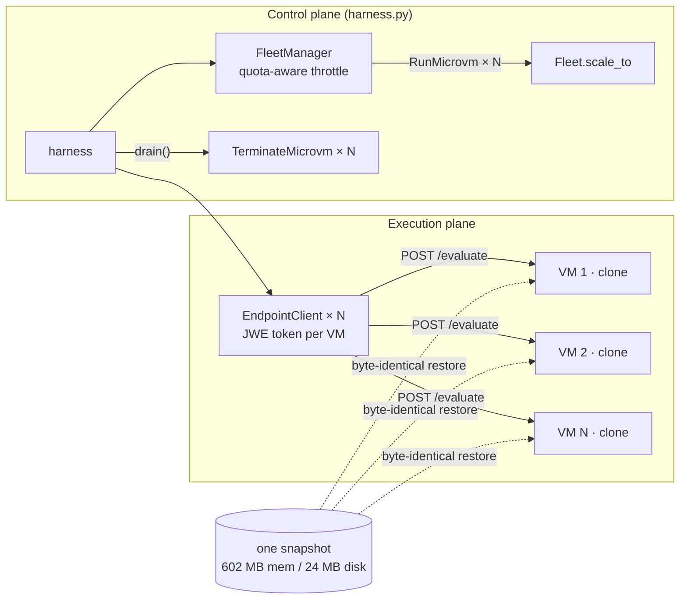
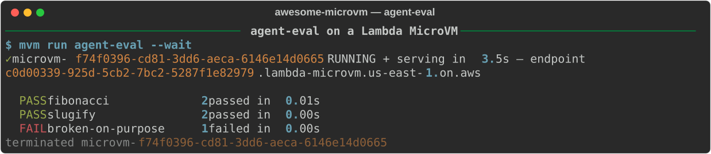

# Evaluating agents on a fleet of byte-identical microVMs

*Fan an eval suite across pristine Firecracker clones — 0 → 6 running VMs in 9.7 s, every score from an environment that is byte-for-byte identical to every other, drained in 0.7 s when the scoreboard prints.*

The silent killer of RL and eval pipelines is contamination. Task 47 pip-installs a package, task 48 inherits it and passes tests it should have failed; a previous run leaves a file in `/tmp` and your pass rate drifts by two points between Tuesday and Thursday. This is why the labs doing serious agent evaluation — Hugging Face runs tens of thousands of concurrent sandboxes for exactly this — insist on one disposable, identical environment per task. AWS Lambda MicroVMs gives you that primitive natively: every VM you launch from an image is a restored copy of the *same* memory-and-disk snapshot. Not "same Dockerfile, rebuilt" — same bytes.

This post walks through `examples/agent-eval` in [awesome-microvm](https://github.com/vivekrajaps/awesome-microvm): a stdlib-only eval worker, a harness that fans a task suite across a fleet with `Fleet.scale_to`, and a deliberately broken third task to prove the harness reports failure honestly. Everything below was measured on the live service in `us-east-1`.

## Why a microVM (and not a container or a Lambda function)

Containers give you filesystem isolation but not determinism: two containers from one image still diverge the moment PID 1 starts — different entropy, different timing, different package resolution if anything installs at runtime. A warm container pool is worse: reuse is exactly the contamination you're trying to kill. Lambda functions isolate well but cap execution time and give you no way to run an arbitrary long-lived pytest process against a workspace you control.

A microVM clone restores the *entire machine state* from a snapshot: every process's memory, the full disk, even RNG state. For eval, that means the interpreter, the installed `pytest`, and every byte of the filesystem are provably identical across workers and across runs. The failure mode flips from "silent drift" to a known, documented gotcha — snapshot uniqueness — which the runtime hooks exist to solve (more below). And because launch-to-serving is measured at p50 3.54 s, "one fresh VM per shard" is a thing you do casually, not a provisioning project.

## Architecture



Two planes, one snapshot. The control plane builds the image once, launches N clones through a token-bucket throttle read from your *applied* Service Quotas, and terminates them at the end. The execution plane mints a port-scoped JWE auth token per VM (there is no load balancer — each VM gets its own HTTPS endpoint) and round-robins tasks over the fleet. Every worker restores from the same 602 MB memory / 24 MB disk snapshot, built once in 133.3 s.

## Build it

The Dockerfile says the quiet part out loud:

```dockerfile
# Every VM is a byte-for-byte clone of the same snapshot: no contamination
# between runs, no flaky shared state, horizontal fan-out limited only by quota.
FROM public.ecr.aws/lambda/microvms:al2023-minimal

RUN dnf install -y python3.12 python3.12-pip git && dnf clean all
RUN python3.12 -m pip install --no-cache-dir pytest requests

WORKDIR /app
COPY microvm_hooks.py app.py /app/

EXPOSE 8080
ENTRYPOINT ["python3.12", "/app/app.py"]
```

The worker (`app.py`) is a zero-dependency HTTP server on the vendored `HookApp`. Two hooks matter for this use case. `/ready` gates the snapshot: the build only captures state after it returns 200, so `pytest` is imported and warm in every clone. `/run` fires on each *launched clone* and is where per-VM identity enters a world of identical bytes:

```python
@app.on_run
def on_run(ctx):
    IDENTITY["worker"] = str(uuid.uuid4())[:8]
    payload = ctx.get("runHookPayload")
    IDENTITY["assignment"] = json.loads(payload) if payload else None  # e.g. {"shard": 3}
```

This is the snapshot-uniqueness fix in miniature. The UUID is generated *after* restore (the HookApp also reseeds the RNG in `/run` — otherwise every clone would draw the same "random" numbers), and `runHookPayload` is the per-VM channel for shard assignments. Image env vars are the wrong place for that — they're image-level, shared by every clone.

The `/evaluate` route wipes its workspace before every task, so even task reuse within one worker starts clean:

```python
@app.route("POST", "/evaluate")
def evaluate(body, _headers):
    for f in os.listdir(WORK):  # each task starts from a clean slate
        path = os.path.join(WORK, f)
        subprocess.run(["rm", "-rf", path])
    ...
    proc = _sh(["python3.12", "-m", "pytest", "test_candidate.py", "-q", "--tb=line"])
```

The harness is where the fleet mechanics live. Scale-out is one call; note the hard lifetime cap — eval fleets are disposable by construction:

```python
fleet = Fleet(
    FleetManager(cfg), args.image,
    idle_policy=IdlePolicy(max_idle=600, suspended_for=60, auto_resume=False),
    max_duration=3600,  # eval fleets are disposable — hard cap their lifetime
)
fleet.scale_to(args.workers, wait_running=True)
```

Routing is deliberately boring — round-robin over per-VM endpoint clients, fanned out on a thread pool:

```python
def run_task(i_task):
    i, task = i_task
    client = clients[i % len(clients)]
    resp = client.post("/evaluate", json=task, timeout=180)
    return task["task_id"], resp.json() if resp.ok else {"passed": False, "error": resp.text}

with futures.ThreadPoolExecutor(max_workers=len(clients)) as pool:
    results = dict(pool.map(run_task, enumerate(tasks)))
```

And when the scoreboard prints, the fleet dies: `fleet.drain()` terminates every member unless you passed `--keep-fleet`.

The task suite includes a canary. `tasks.json` ships three tasks, and the third is wrong on purpose:

```json
{
  "task_id": "broken-on-purpose",
  "candidate_code": "def add(a, b):\n    return a - b\n",
  "tests": "from candidate import add\n\ndef test_add():\n    assert add(2, 2) == 4\n"
}
```

An eval harness that has never been seen to fail is an eval harness you can't trust. This one must report 2/3 or it's broken.

## Run it

The demo transcript runs the suite against a single worker:



`$ mvm run agent-eval --wait` has the VM RUNNING and serving authenticated traffic in 3.5 s. Then the scoreboard, exactly as the tasks predict: **PASS fibonacci** (2 passed in 0.01 s), **PASS slugify** (2 passed in 0.00 s), **FAIL broken-on-purpose** (1 failed in 0.00 s) — the canary caught, score 2/3 — and the VM is terminated.

The fleet path is where the numbers get interesting. On this account, `scale_to(6)` took a fresh fleet from 0 to 6 RUNNING microVMs in **9.7 s wall**, with the FleetManager throttling `RunMicrovm` to 0.8/s — 80% of the applied 1/s quota (that run used the 512 MiB `sandbox-small` image; see the quota gotcha below for why). `drain()` terminated all 6 in **0.7 s**. Per-task overhead once workers are up is small: a warm authenticated request into a VM lands at p50 111 ms, and each `/evaluate` is that plus your pytest runtime.

## What it costs

Rates in `us-east-1`, billed per second:

| Item | Rate |
|---|---|
| vCPU | $0.0000276944/vCPU-s |
| Memory | $0.0000036667/GB-s |
| Snapshot write / read | $0.0038 / $0.00155 per GB |
| Suspended + image storage | $0.08/GB-month |

Measured with the repo's CostModel on a 2 GB / 1 vCPU VM with our 0.61 GB snapshot: an 8-second one-shot job that terminates costs **$0.0003**. A whole 6-worker eval run is six of those plus your test runtime — fractions of a cent per suite.

Now the part specific to eval fleets: **terminate, don't suspend.** Suspend/resume is the service's headline feature, and for a notebook or a chat agent it's the right call — a 30 min active + 8 h suspended session came out 93.8% cheaper than always-on. But one suspend/resume cycle on a 0.61 GB snapshot costs ≈ **$0.0034** in snapshot write + read — more than ten times the entire $0.0003 one-shot run. An eval worker has no state worth $0.0034 to preserve; its whole value is that the *next* run starts from the pristine image snapshot, not from whatever the last task did to the filesystem. Suspending an eval worker pays extra to keep exactly the contamination you built this to avoid. (The naive alternative — an always-on 2 GB runner — is ~$3.03/day whether or not any evals run.)

## The gotchas

- **The applied memory quota is your real fleet ceiling.** Our fresh account's applied quota was **8 GB total microVM memory** — against a published default of 1,024 GB — and it counts RUNNING, SUSPENDED, *TERMINATING*, and image-build VMs. With 2 GB eval workers that's a 4-VM fleet, minus headroom for VMs still tearing down. We hit `ServiceQuotaExceededException` twice: once when 5 concurrent image builds ate the quota, once when freshly-terminated VMs still counted. Fixes, in order: shrink the worker (our 6-VM fan-out ran the 512 MiB image), have the FleetManager read *applied* quotas at startup and throttle to 80% (it does), and file the raise on day one — our `RunMicrovm` 1/s → 5/s request was auto-approved from a single API call.
- **Clones share everything from the snapshot, including entropy.** Without the `/run`-time RNG reseed and UUID generation shown above, "random" worker IDs and any stochastic test behavior would be identical across the fleet. Never bake per-worker values or secrets into the image; use `runHookPayload` and the execution role.
- **One endpoint per VM, no load balancer.** The harness holds N `EndpointClient`s and does its own round-robin. Each client mints and caches its own port-scoped token; that first token mint makes the first request to a fresh VM ~700 ms before settling to ~111 ms.
- **ARM64 only.** The workers are Graviton. Pure-Python eval suites don't care; audit wheels before pointing this at a suite with native dependencies.

## Take it further

- **Shard real suites via `runHookPayload`** — pass `{"shard": k}` at launch and have each worker pull its slice from S3 instead of round-robinning tasks over HTTP (the endpoint is bandwidth-capped at 1–16 MB/s; bulk data belongs on S3/EFS).
- **Score model-generated code** by pointing the [ai-code-runner](02-ai-code-runner.md) worker's Bedrock loop at this harness: generate on one fleet, evaluate on another, no shared state anywhere.
- **Exercise the hot path in `/validate`** — it runs on a restored clone and the service prefetches the snapshot pages it touches, so a dry-run pytest there shaves the first real task's cold path.

---

Code, CLI, and the benchmark harness behind every number: [github.com/vivekrajaps/awesome-microvm](https://github.com/vivekrajaps/awesome-microvm). Series: [overview](00-control-and-scale-microvms-like-a-pro.md) · [code sandbox](01-code-sandbox.md) · [AI code runner](02-ai-code-runner.md) · **agent eval** · [notebook](04-notebook.md) · [data analytics](05-data-analytics.md) · [CI runner](06-ci-runner.md) · [PDF service](07-pdf-service.md) · [multi-tenant agents](08-multi-tenant-agents.md).
