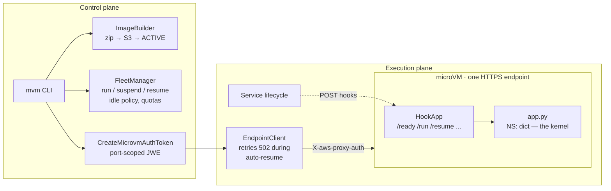
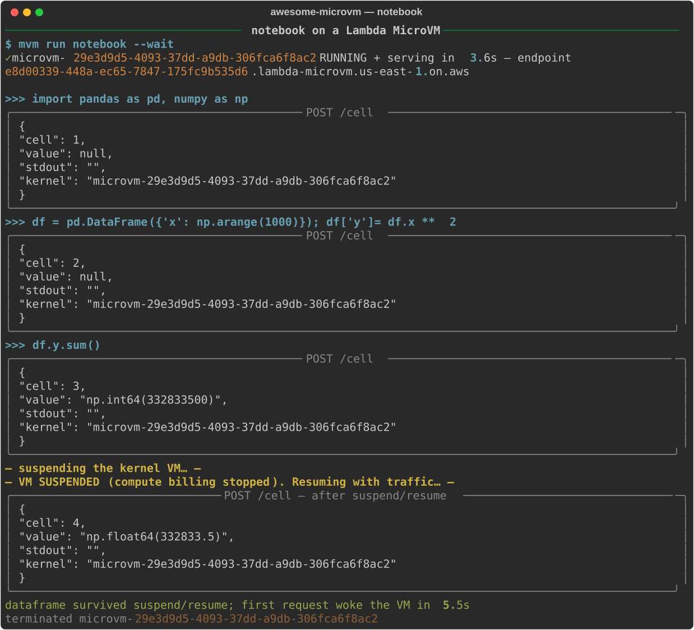

# The Notebook Kernel That Sleeps for Free

*A stateful Python kernel on a Lambda MicroVM: the dataframe you built before lunch is byte-for-byte intact after — same process, same PID — and while you were away it billed as storage, not compute.*

Every hosted notebook platform faces the same ugly ratio: users think for hours and compute for seconds, but the kernel holding their variables must stay resident the whole time. Kill it to save money and `df` is gone; keep it warm and you pay for a 2 GB Python process to do nothing. In our measured session shape — 30 minutes active, 8 hours suspended — a microVM kernel cost **$0.0669 against $1.0719 for the always-on equivalent: 93.8% saved**, and the user never noticed the kernel had been asleep.

This is the fourth post in the awesome-microvm series, and it's the one suspend/resume was built for.

## Why a microVM (and not a container or a Lambda function)

A notebook kernel is the worst case for both incumbents. A Lambda function is stateless by design: every invocation is a fresh process, so `x = 41` in one call and `x + 1` in the next requires serializing the entire namespace to external storage — which breaks the moment the namespace holds an open file handle, a fitted model, or a generator. A container (Fargate, ECS) holds state fine but bills every second it exists; "stop the task" destroys memory, so pausing a kernel means pickling everything, and pickling everything is the problem we started with.

A Lambda MicroVM suspends. The service snapshots the entire guest — every process's memory, the disk, connections, even RNG state — and compute billing stops. Resume restores it exactly: we verified **PID 1 before, PID 1 after**, execution counters and workspace files intact. For a notebook that means the namespace dict, the imported pandas module, and the 1000-row DataFrame all survive without a single byte of serialization code. The state *is* the snapshot.

## Architecture



Two planes. The control plane builds the notebook image, launches VMs with an idle policy, and mints port-scoped auth tokens. The execution plane is one dedicated HTTPS endpoint per VM (there is no load balancer) plus the lifecycle hooks the service POSTs into your app. The kernel itself is nothing exotic: a module-level `dict` in a stdlib HTTP server.

## Build it

The Dockerfile is short because the heavy lifting happens at snapshot time:

```dockerfile
FROM public.ecr.aws/lambda/microvms:al2023-minimal

RUN dnf install -y python3.12 python3.12-pip && dnf clean all
RUN python3.12 -m pip install --no-cache-dir numpy pandas matplotlib

WORKDIR /app
COPY microvm_hooks.py app.py /app/

EXPOSE 8080
ENTRYPOINT ["python3.12", "/app/app.py"]
```

The kernel is a persistent namespace and one clever route. The service only snapshots after `/ready` returns 200, so we import numpy and pandas *inside the ready hook* — the import cost is paid once at build time and every clone wakes with the libraries already in memory:

```python
app = HookApp()
NS: dict = {}

@app.on_ready
def ready(_ctx):
    import numpy, pandas  # imported into the snapshot, warm for every clone
    return True

@app.on_run
def on_run(ctx):
    KERNEL["id"] = ctx.get("microvmId") or str(uuid.uuid4())[:8]
    KERNEL["started"] = time.time()
```

`/run` matters for a different reason: every VM launched from this image is a clone of the same snapshot, so anything "unique" baked in at build time is identical across kernels. We derive the kernel ID at run time from `microvmId`, and the vendored `HookApp` reseeds the RNG in the same hook.

The `/cell` endpoint reproduces the REPL's eval-versus-exec dance — try the code as an expression so `df.y.sum()` returns a value, fall back to statement execution so `x = 41` works too, and run everything against the same `NS` dict:

```python
@app.route("POST", "/cell")
def cell(body, _headers):
    code = body.get("code", "")
    KERNEL["cells"] += 1
    out = io.StringIO()
    value = None
    try:
        with contextlib.redirect_stdout(out):
            try:
                value = eval(compile(code, "<cell>", "eval"), NS)  # expression?
            except SyntaxError:
                exec(compile(code, "<cell>", "exec"), NS)
    except Exception as e:
        return 400, {"cell": KERNEL["cells"], "error": f"{type(e).__name__}: {e}",
                     "stdout": out.getvalue()}
    return 200, {"cell": KERNEL["cells"], "value": repr(value) if value is not None else None,
                 "stdout": out.getvalue(), "kernel": KERNEL["id"]}
```

`GET /kernel` is the introspection endpoint — and the receipt for the resume demo. It reports `os.getpid()`, uptime, cells executed, and `{k: type(v).__name__}` for every user variable. If suspend/resume were secretly restarting the process, this endpoint would rat it out.

Build and launch:

```console
$ mvm image build notebook examples/notebook
$ mvm run notebook --wait --idle 900 --suspended-ttl 28800
```

The notebook image built in 133.4 s and produced a 660 MB memory snapshot plus 24 MB of disk. Those two `run` flags are the idle policy, and for interactive sessions they deserve thought. `--idle` (default 300 s) is how long the endpoint can go quiet before the service suspends the VM; a user who stares at a plot for six minutes *is* idle by that definition, so we stretch it to 15 minutes for humans. `--suspended-ttl` is sneakier: `suspendedDurationSeconds` doubles as an **auto-terminate timer**. Leave it at the 3600 s default and a kernel suspended over a long lunch is not asleep when the user returns — it's destroyed, state and all. We set it high for notebooks, within the service's hard 8-hour (28,800 s) total lifetime.

## Run it

The live transcript, captured against the real service:



`mvm run notebook --wait` had the VM RUNNING and serving authenticated traffic in **3.6 s** (fleet-wide we measured p50 3.54 s, p95 4.49 s to first authenticated byte). Then four cells:

1. `import pandas as pd, numpy as np` — cell 1, instant, because the snapshot already holds the imports.
2. `df = pd.DataFrame({'x': np.arange(1000)}); df['y'] = df.x ** 2` — cell 2 builds the DataFrame into `NS`.
3. `df.y.sum()` — cell 3 returns `np.int64(332833500)`.
4. We **suspend the VM**. Compute billing stops. Then, without calling `ResumeMicrovm`, we just POST the next cell — a mean over the same dataframe — and it returns `np.float64(332833.5)`, cell counter at 4, same kernel ID. The dataframe survived; in this capture the waking request completed in **5.5 s** end to end, while our dedicated benchmark run measured a suspended VM answering its first request with a 200 in **0.7 s**. Explicit lifecycle calls came in at **2.5 s to suspend and 2.6 s to resume**.

The client makes the sleep invisible: `EndpointClient` treats a 502 as "possibly mid-resume" and retries patiently, so a notebook frontend never needs to know the kernel was suspended. Warm cells, for reference, ran at p50 111.0 ms including TLS, proxy auth, and execution inside the VM.

## What it costs

us-east-1 rates: $0.0000276944 per vCPU-second, $0.0000036667 per GB-second, suspended snapshot storage $0.08/GB-month, snapshot write $0.0038/GB and read $0.00155/GB. Our worked examples use a 2 GB / 1 vCPU VM:

| Session shape | MicroVM kernel | Always-on kernel | Saved |
|---|---|---|---|
| 30 min active + 8 h suspended | $0.0669 | $1.0719 | **93.8%** |
| 2 h active + 22 h suspended | $0.2602 | $3.0264 | **91.4%** |
| 24/7 always-on 2 GB | — | ~$3.03/day | the shape where microVMs lose |

For a per-user notebook platform the multiplication is the story. A hundred data scientists on always-on 2 GB kernels is ~$303/day whether anyone shows up. A hundred microVM kernels at the 30-min-active shape is about $6.69/day — and a kernel parked suspended costs only storage, roughly five cents a month for our 660 MB snapshot at $0.08/GB-month. Idle capacity stops being a line item and becomes a rounding error.

One honest number pushing the other way: a suspend/resume cycle isn't free — about $0.0034 in snapshot write+read on a 0.61 GB snapshot. An idle policy aggressive enough to thrash (suspend, wake, suspend, wake) pays that toll every cycle, which is another reason interactive kernels want a generous `--idle`.

## The gotchas

- **Idle detection keys off endpoint traffic — in both directions.** A user reading results generates no requests and gets suspended; a frontend that polls `/kernel` every 30 seconds generates constant requests and keeps the VM billing forever. Health checks belong outside the idle window, or your 93.8% savings quietly become 0%.
- **`suspendedDurationSeconds` is a self-destruct timer.** It is not "how long suspend is allowed" in a benign sense — when it elapses, the VM auto-terminates and the namespace is gone. Size it to your users' longest absence.
- **The 8-hour ceiling is hard.** Total VM lifetime maxes out at 28,800 s, so a kernel cannot live indefinitely. A real platform needs an end-of-life story: warn the user, offer an explicit export, or accept mortality.
- **Clones share the snapshot's "uniqueness".** Every kernel starts from identical memory — same RNG state, same build-time IDs. Derive per-kernel identity in `/run` (we do) and never bake per-user secrets into image env vars, which are shared by every clone.

## Take it further

- **Persist across the 8-hour wall**: add a `/suspend` hook that pickles `NS` to S3 via the execution role, and a `/run`-time restore — cheap insurance for the kernels that live long enough to die.
- **Real notebook frontend**: the `/cell` contract maps almost one-to-one onto Jupyter's execute_request; `EndpointClient`'s patient-502 retry already gives you transparent wake-on-execute.
- **Per-user fleets**: `mvm scale notebook N --idle 900` plus `runHookPayload` for user identity turns this single kernel into a multi-tenant platform — the pattern our multi-tenant-agents example demonstrates.

---

*Code and transcripts: [awesome-microvm](https://github.com/vivekrajaps/awesome-microvm) — see [`examples/notebook`](../examples/notebook/); the plane: [microvm-ctl](https://github.com/vivekrajaps/microvm-ctl) (`pip install microvm-ctl`). Series: [Control and scale microVMs like a pro](00-control-and-scale-microvms-like-a-pro.md).*
