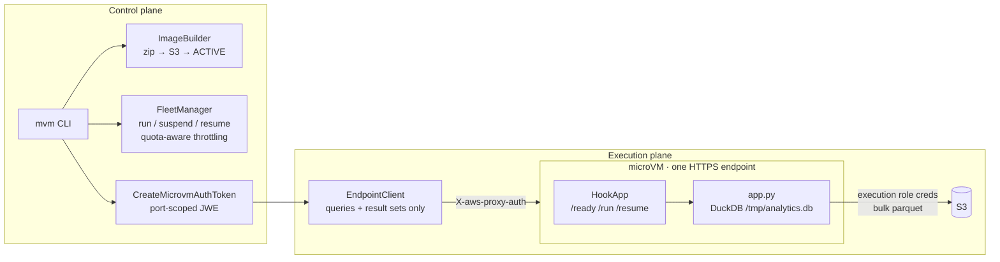
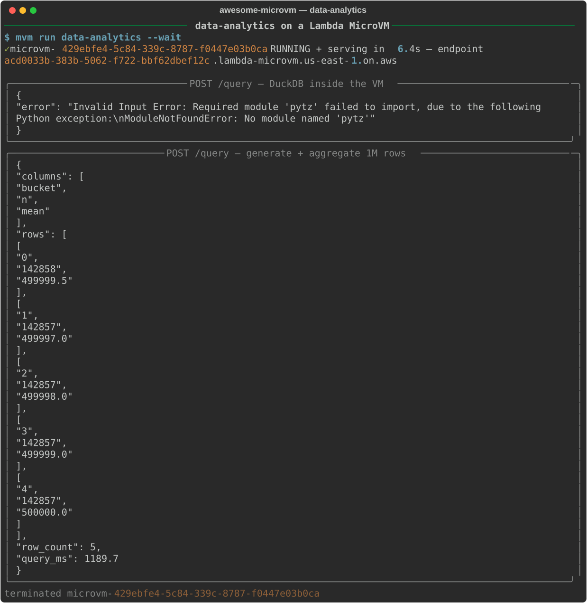

# A Database Per User, Priced Like a Query

*DuckDB inside a Lambda MicroVM: one analytics engine per user or agent, loaded tables that survive suspend, and a blast radius of exactly one VM when the LLM's SQL goes wrong.*

An LLM that writes SQL is an untrusted user with a keyboard. DuckDB will happily `COPY` to any path, read any file the process can see, and load extensions — so the question is never "can we sanitize the query" but "what does the query get to touch." At the same time, analytics sessions are stateful: an analyst loads a parquet file once and then asks it forty questions, and re-scanning S3 for every question is the tax you pay for statelessness. We wanted both properties at once — hard isolation per user *and* a warm engine that keeps tables loaded between queries — without paying for a fleet of always-on database containers. On Lambda MicroVMs, our measured burst-analyst session shape (30 minutes active, 8 hours suspended) cost **$0.0669 against $1.0719 always-on — 93.8% saved**.

This is the fifth post in the awesome-microvm series. AWS's launch taxonomy for the service lists data analytics — "notebooks and user/LLM-supplied scripts with large working sets" — as a core pattern, with ClickHouse's chDB as a named launch partner for exactly this shape. We built the DuckDB version.

## Why a microVM (and not a container or a Lambda function)

A Lambda function fails the statefulness test: every invocation is a fresh process, so the table you loaded for query one is gone by query two, and each question re-pays the full S3 scan. A shared warehouse (or one big DuckDB service) fails the isolation test: LLM-generated SQL from tenant A runs in the same process that holds tenant B's data, and DuckDB's file and extension access makes "read-only SQL" a fiction. A per-user Fargate container gets both properties but bills every second the analyst is thinking — and analysts mostly think.

A microVM is a per-user process boundary that *sleeps*. Each engine is a Firecracker VM with its own kernel, its own disk, its own IAM-scoped credentials, and its own dedicated HTTPS endpoint. Loaded tables live in VM memory and on VM disk between queries, the whole working set survives suspend/resume (we verified same process, PID 1 → PID 1, files intact), and a parked engine bills as snapshot storage, not compute. A hostile query can trash its own VM; `mvm terminate` is the cleanup.

## Architecture



Two planes, and one rule that makes the whole design work: **bulk data never crosses the endpoint**. The per-VM endpoint is bandwidth-capped by VM size (1 MB/s on a 0.5 GB VM up to 16 MB/s on an 8 GB VM), which would make it a miserable pipe for a parquet file. So datasets ride the S3 side channel — DuckDB's `httpfs` reads `s3://` URIs directly using the VM's execution-role credentials — and only two things cross the capped endpoint: the SQL going in and the (capped-at-1000-rows) result set coming out. Both are small by construction.

## Build it

The Dockerfile is three meaningful lines:

```dockerfile
FROM public.ecr.aws/lambda/microvms:al2023-minimal

RUN dnf install -y python3.12 python3.12-pip && dnf clean all
RUN python3.12 -m pip install --no-cache-dir duckdb pyarrow boto3

WORKDIR /app
COPY microvm_hooks.py app.py /app/

EXPOSE 8080
ENTRYPOINT ["python3.12", "/app/app.py"]
```

The interesting engineering is in the hooks, because each one maps to a snapshot-semantics rule.

**`/ready` bakes the engine into the snapshot.** The service only snapshots after `/ready` returns 200, so we open the database and install the S3 extensions there — every clone wakes with `httpfs` and `aws` already loaded, cost paid once at build time:

```python
@app.on_ready
def ready(_ctx):
    global _db
    import duckdb
    _db = duckdb.connect("/tmp/analytics.db")
    _db.execute("INSTALL httpfs; LOAD httpfs; INSTALL aws; LOAD aws;")
    return True
```

**`/run` creates credentials — and deliberately cannot fail.** Credentials must *not* go in at build time: the snapshot is cloned into every VM, so a baked-in credential is a credential shared by every tenant. Instead each VM builds its S3 secret from its own execution role when it starts. And note the swallow-everything `try`: a non-200 from `/run` terminates the VM, and an engine without S3 access is degraded, not dead — it can still serve local queries:

```python
@app.on_run
def on_run(_ctx):
    # Credentials come from the execution role at run time — never the snapshot.
    # Never let credential setup fail the /run hook: a non-200 terminates the VM;
    # a VM without S3 access can still serve local queries.
    try:
        _db.execute("CREATE OR REPLACE SECRET aws (TYPE s3, PROVIDER credential_chain);")
    except Exception as e:
        print(f"s3 secret setup skipped: {e}", flush=True)


@app.on_resume
def on_resume(ctx):
    on_run(ctx)  # role credentials rotate; refresh after resume
```

**`/resume` re-runs `/run`** because a suspended VM's snapshot contains the credentials it had when it went to sleep, and role credentials rotate. An engine that sleeps through a rotation would wake with dead credentials and start failing S3 reads for no visible reason; refreshing the secret on resume closes that hole.

The API surface is two routes. `/load` pulls a parquet file from S3 into a named table — the one moment bulk data moves, and it moves over the side channel:

```python
@app.route("POST", "/load")
def load(body, _headers):
    table, uri = body.get("table"), body.get("s3_uri")
    ...
    _db.execute(f"CREATE OR REPLACE TABLE {table} AS SELECT * FROM read_parquet(?)", [uri])
```

`/query` runs whatever SQL arrives — which is the point; the VM is the sandbox, so the app doesn't pretend to be one — catches any DuckDB error as a 400 with the message truncated to 2 KB, and returns at most 1000 rows with a measured `query_ms`. Errors are data for the LLM's repair loop, not incidents.

```console
$ mvm image build data-analytics examples/data-analytics
$ mvm run data-analytics --wait
```

The image built in 133.7 s: a 680 MB memory snapshot (largest of our eight images — DuckDB plus pyarrow is not small) and 26 MB of disk.

## Run it

The live transcript against the real service:



`mvm run data-analytics --wait` had the VM RUNNING and serving in **6.4 s** in this capture — slower than our fleet-wide p50 of 3.54 s (p95 4.49 s); launches vary, and this one drew a long straw.

The first `/query` in the transcript *fails*, on purpose in spirit: the SQL touched a code path needing `pytz`, and DuckDB returned `Invalid Input Error: Required module 'pytz' failed to import ... ModuleNotFoundError: No module named 'pytz'`. The engine surfaced it as a 400 JSON body and kept serving — exactly the behavior you want when the SQL author is a language model that will read the error and try again. This is also the honest reality of a minimal image: our Dockerfile installs `duckdb pyarrow boto3` and nothing else, so timezone-flavored Python UDF paths are out until you add the package.

The second query is the real work: generate and aggregate **one million rows** — a `GROUP BY` into five buckets, counting and averaging. It returned five rows (`bucket`, `n`, `mean`: counts of 142,857–142,858, means around 499,999) with **`query_ms: 1189.7`** measured inside the VM. That's a million-row aggregation in about 1.2 s on a 2 GB / 1 vCPU microVM, with the result set crossing the endpoint as a few hundred bytes of JSON.

## What it costs

us-east-1 rates: $0.0000276944 per vCPU-second, $0.0000036667 per GB-second, suspended snapshot storage $0.08/GB-month, snapshot write $0.0038/GB, read $0.00155/GB. Worked examples on a 2 GB / 1 vCPU VM:

| Session shape | MicroVM engine | Always-on engine | Saved |
|---|---|---|---|
| 30 min active + 8 h suspended | $0.0669 | $1.0719 | **93.8%** |
| 2 h active + 22 h suspended | $0.2602 | $3.0264 | **91.4%** |
| 24/7 always-on 2 GB | — | ~$3.03/day | the shape where microVMs lose |

The 30-minute shape *is* the analyst: load a table, fire a burst of questions, leave the tab open. An always-on per-user engine bills the tab; a microVM bills the burst. Parked, the engine costs snapshot storage — our 680 MB snapshot at $0.08/GB-month is about five and a half cents a month. Two caveats keep the math honest: a suspend/resume cycle costs about $0.0034 in snapshot write+read (on a 0.61 GB snapshot), so a thrashing idle policy pays a toll per nap; and truly one-shot queries should terminate, not suspend — an 8-second one-shot ran us $0.0003.

## The gotchas

- **The bandwidth cap is a design constraint, not a footnote.** 1 MB/s (0.5 GB VM) to 16 MB/s (8 GB VM) on the endpoint. The moment someone "just POSTs the CSV" or `SELECT *`s a big table back through the endpoint, queries crawl. Keep the discipline: data via S3, endpoint for SQL and small results — and cap result rows in the app, as `/query`'s `fetchmany(1000)` does.
- **Snapshots clone credentials and rotate out from under you.** Never create the S3 secret at build time (shared by every tenant's clone); create it in `/run` from the execution role, and re-create it in `/resume` because role credentials rotate while the VM sleeps.
- **A failing hook is a dead VM.** Any non-200 from `/run` terminates the machine. Wrap best-effort setup — like our credential bootstrap — so a transient IAM hiccup degrades the engine instead of killing it.
- **Idle detection watches endpoint traffic, and `suspendedDurationSeconds` is a self-destruct timer.** An analyst staring at results is "idle" and gets suspended (good — that's the 93.8%), but when the suspended TTL elapses the VM auto-terminates, loaded tables and all, inside a hard 8-hour total lifetime. Size the TTL to your users' longest absence and have an export story.

## Take it further

- **Swap the engine**: the hook pattern is engine-agnostic — ClickHouse's chDB (the pattern's named launch partner) drops into the same `/ready`-bake, `/run`-credentials skeleton.
- **Close the LLM loop in-VM**: call Bedrock through the same execution role (our ai-code-runner shows the pattern) so text-to-SQL, execution, and error-driven retry all happen inside the sandbox.
- **Write big results to S3**: for outputs over a few MB, `COPY (...) TO 's3://...'` over the side channel and return the URI — the same rule that governs ingress governs egress.

---

*Code, transcripts, and benchmark harness: `github.com/vivekrajaps/awesome-microvm` — see [`examples/data-analytics`](../examples/data-analytics/). Series: [Control and scale microVMs like a pro](00-control-and-scale-microvms-like-a-pro.md).*
