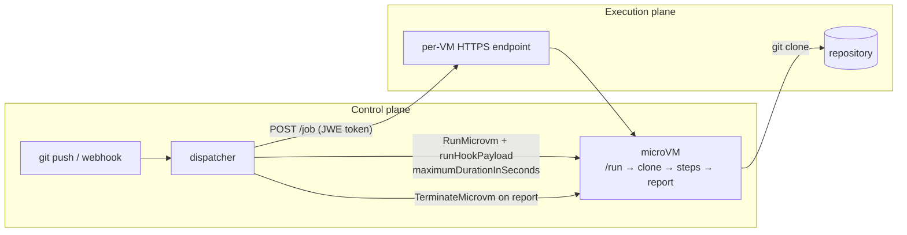
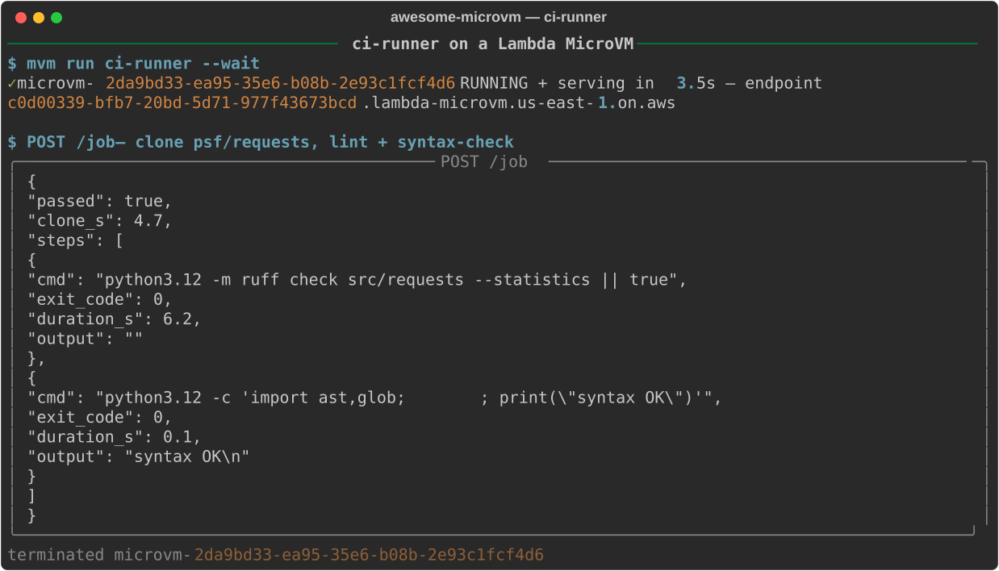

# A CI runner nobody has ever touched

*Ephemeral CI on Lambda MicroVMs: every job gets a pre-warmed VM born from a snapshot, clones, lints, tests, reports — and dies. Measured live in us-east-1.*

Your self-hosted CI runner is the most-trusted, least-audited machine in your infrastructure. It holds clone credentials, package registry tokens, and deploy keys; it executes whatever arrives in a pull request; and because provisioning is slow, it lives for weeks — accumulating poisoned caches, leftover containers, and cross-job contamination from every workload it has ever run. And when no jobs are queued, it sits on EC2 billing you for the privilege. We rebuilt the runner on AWS Lambda MicroVMs so that every job executes in a VM no other job has ever touched: pre-warmed from a snapshot to serving traffic in a measured **p50 of 3.54 s**, terminated the moment the report is returned.

## Why a microVM (and not a container or a Lambda function)

Containers share a kernel with their host, and CI is the canonical untrusted-code workload — a malicious `setup.py` in a dependency runs with everything the runner can see. A Lambda function gives you kernel isolation but the wrong shape: CI jobs want `git`, a full toolchain, arbitrary subprocesses, and minutes of runtime, not a frozen handler with a 15-minute ceiling.

A Lambda MicroVM is a Firecracker VM with a full AL2023 userland — hardware-virtualized isolation, real processes, up to 8 hours of runtime — with the one property that makes ephemeral runners economically sane: it boots from a **memory snapshot**. The toolchain install that makes fresh-VM-per-job too slow on EC2 (minutes of cloud-init and `pip install`) happens once, at image build time. Every runner after that is a clone of the warmed state. Isolation without the provisioning tax.

## Architecture



Two planes. The control plane owns lifecycle: the dispatcher answers a push webhook with one `RunMicrovm` call — carrying the job context as `runHookPayload` and a `maximumDurationInSeconds` cap — and one `TerminateMicrovm` when the report lands. The execution plane is the VM's own dedicated HTTPS endpoint (`<id>.lambda-microvm.us-east-1.on.aws`; there is no load balancer), authenticated per-request with a port-scoped JWE token. The runner never holds long-lived credentials: clone tokens arrive with the job, and anything AWS-side comes from the VM's execution role.

## Build it

The image is deliberately boring. Bake the toolchain — and, for real projects, a warm pip cache of your dependency tree — into the snapshot, so no job ever pays for it again:

```dockerfile
# Ephemeral CI runner — clone, test, report, terminate (Pattern C: no suspend).
# Toolchain and warm pip cache are baked into the snapshot, so every job starts
# on a pre-warmed runner in seconds instead of provisioning one for minutes.
FROM public.ecr.aws/lambda/microvms:al2023-minimal

RUN dnf install -y python3.12 python3.12-pip git tar gzip && dnf clean all
RUN python3.12 -m pip install --no-cache-dir pytest coverage ruff

WORKDIR /app
COPY microvm_hooks.py app.py /app/

EXPOSE 8080
ENTRYPOINT ["python3.12", "/app/app.py"]
```

```console
$ mvm image build ci-runner examples/ci-runner
```

The build ran the Dockerfile on a fresh build VM, hit our `/ready` hook, and snapshotted: **123.1 s** wall from zip upload to an ACTIVE version, producing a **605 MB memory snapshot** and a **24 MB disk snapshot**. That two-minute cost is paid once per image version — every runner clone afterward restores from it in seconds.

The app is a single file. Two hooks matter for this use case. `/ready` gates the snapshot — we refuse to snapshot a runner whose `git` doesn't work, because a broken snapshot is cloned into *every* future job:

```python
@app.on_ready
def ready(_ctx):
    subprocess.run(["git", "--version"], capture_output=True, check=True)
    return True
```

And `/run` fires once per clone, at launch — this is where per-job context arrives for push-style dispatch, so the image itself stays generic and secret-free:

```python
@app.on_run
def on_run(ctx):
    # Per-job context (repo, ref) can arrive as runHookPayload for push-style dispatch.
    payload = ctx.get("runHookPayload")
    if payload:
        with open("/tmp/assignment.json", "w") as f:
            f.write(payload)
```

The job itself is a shallow clone followed by whatever steps the dispatcher sends, each captured with exit code, duration, and tail-truncated output:

```python
@app.route("POST", "/job")
def job(body, _headers):
    repo, ref = body.get("repo_url"), body.get("ref", "main")
    if not repo:
        return 400, {"error": "need 'repo_url'"}
    subprocess.run(["rm", "-rf", JOB_DIR])
    clone = _sh(f"git clone --depth 1 --branch {ref} {repo} {JOB_DIR}", "/tmp", timeout=300)
    if clone["exit_code"] != 0:
        return 500, {"stage": "clone", **clone}
    steps = [
        _sh(step, JOB_DIR)
        for step in body.get("steps", ["python3.12 -m pytest -q"])
    ]
    passed = all(s["exit_code"] == 0 for s in steps)
    return 200, {"passed": passed, "clone_s": clone["duration_s"], "steps": steps}
```

Launch with a runaway cap. `maximumDurationInSeconds` is the control-plane guarantee that a hung test suite, a fork bomb in a malicious PR, or a wedged `git clone` cannot outlive its budget — the service terminates the VM for you, no reaper required:

```console
$ mvm run ci-runner --max-duration 900 --payload '{"repo_url": "...", "ref": "main"}' --wait
```

## Run it

The live transcript, against a real public repository:



`mvm run ci-runner --wait` went from API call to **RUNNING and serving authenticated traffic in 3.5 s** — consistent with our five-sample benchmark of p50 3.54 s, p95 4.49 s. We then POSTed a job that shallow-cloned `psf/requests` live off the internet (**4.7 s**), ran `ruff` across `src/requests` with `--statistics` (**6.2 s** — suffixed `|| true` in the demo so upstream lint findings don't fail someone else's repo), and ran an `ast`-based syntax check over the tree (**0.1 s**, `syntax OK`). The report came back `"passed": true` with per-step exit codes and durations, and the dispatcher terminated the VM. Total useful work: about eleven seconds on a machine that did not exist fifteen seconds earlier and ceased to exist immediately after.

## What it costs

This is Pattern C: **terminate, never suspend**. Per-second billing at these us-east-1 rates:

| Meter | Rate |
|---|---|
| vCPU | $0.0000276944 / vCPU-second |
| Memory | $0.0000036667 / GB-second |
| Snapshot restore (read) | $0.00155 / GB |

Worked example — a 90-second test run on a 2 GB / 1 vCPU runner (≈95 billed seconds including the ~4 s launch, 0.605 GB snapshot restored):

| Component | Cost |
|---|---|
| vCPU: 95 s × $0.0000276944 | $0.00263 |
| Memory: 95 s × 2 GB × $0.0000036667 | $0.00070 |
| Snapshot read: 0.605 GB × $0.00155 | $0.00094 |
| **Per job** | **≈ $0.0043** |

Under half a cent per job. The naive alternative — an always-on 2 GB runner — costs about **$3.03/day** whether it runs zero jobs or a hundred. At 100 jobs a day the ephemeral fleet costs ~$0.43; you would need on the order of 700 jobs *per day* before the always-on box breaks even, and it still would not give you a clean machine per job. And note what we are *not* paying: a suspend/resume cycle on this snapshot size runs ≈$0.0034 in snapshot I/O — nearly the price of an entire fresh job. For one-shot workloads, terminating is both the cheaper and the more secure move.

## The gotchas

**The snapshot is cloned into every runner — cache and all.** The warm pip cache is exactly why cold starts are fast, but the same mechanism clones any build-time secret, credential, or unique ID into every job. Nothing sensitive goes in the Dockerfile or image env vars (which are image-level, shared by every clone). Clone tokens ride in per-job `runHookPayload`; AWS access comes from the execution role at runtime. The auto-injected `HookApp` also reseeds the RNG in `/run`, so clones don't share entropy.

**`RunMicrovm` TPS is your dispatch ceiling.** One launch per job means your job throughput is capped by the `RunMicrovm` rate — and on our fresh account the *applied* quota was **1/s** (published default: 5/s), with total microVM memory capped at 8 GB, counting TERMINATING VMs and image builds against it. Our fleet manager reads applied quotas from Service Quotas at startup and throttles to 80% of them; our 1→5/s raise was approved from a single API call. File yours on day one — a busy merge queue at 1 launch/s backs up fast.

**Docker-in-VM needs `--caps-all` — and nested DNS bites.** Jobs that build or run containers need the image created with `additionalOsCapabilities: ["ALL"]` (`mvm image build --caps-all`), which enables containerd, FUSE, and eBPF inside the VM. The trap is name resolution: nested containers get their own network namespace, and their UDP DNS lookups don't reach the microVM's resolver by default. Pass explicit DNS servers to the container runtime (or use host networking) or every `docker build` will fail on the first package fetch while the VM itself resolves fine.

**Cap duration at launch, not in code.** The in-app step timeout helps, but only `maximumDurationInSeconds` survives a wedged runner process. Set it to your worst-case job length plus margin; the 8-hour service ceiling is the hard stop.

## Take it further

- **Wire the webhook.** Point a repository push webhook at a small dispatcher that calls `RunMicrovm` with the commit SHA in `runHookPayload` and posts the `/job` report back as a commit status.
- **Ship artifacts via S3.** Endpoint bandwidth is capped (1–16 MB/s by VM size); have steps upload coverage reports and build outputs to S3 with the execution role instead of returning them through the endpoint.
- **Pre-warm a small pool.** At 0→6 RUNNING VMs in 9.7 s, a `scale_to` pool ahead of a merge train hides even the 3.5 s launch from the critical path — drain (0.7 s) when the queue empties.

---

Code, CLI, and the benchmark harness behind every number: [github.com/vivekrajaps/awesome-microvm](https://github.com/vivekrajaps/awesome-microvm). This is part 6 of the series — start with [the control plane overview](00-control-and-scale-microvms-like-a-pro.md), or see the neighboring patterns: [sandboxed data analytics](05-data-analytics.md) and [an HTML-to-PDF service](07-pdf-service.md).
