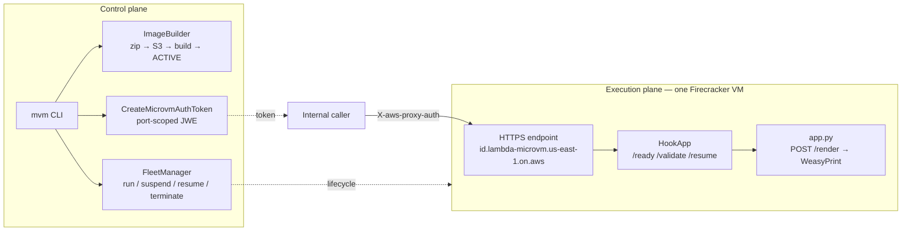
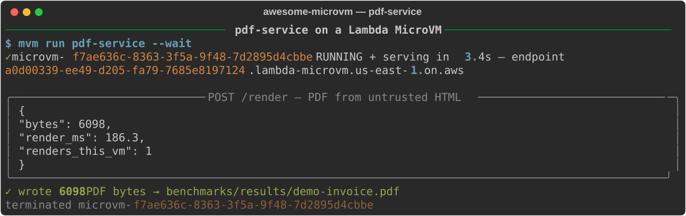

# Rendering Untrusted HTML Is Code Execution in a Fancy Hat

*An HTML→PDF service where every render happens inside a Firecracker microVM — and the VM sleeps between bursts, so an internal tool used a few times a day costs almost nothing at rest.*

Someone on your team wants "a little endpoint that turns HTML into invoice PDFs." The HTML comes from users — template fields, rich-text editors, sometimes whole documents pasted in. An HTML renderer is a parser for markup, CSS, images, and fonts, all of it attacker-controlled, and every one of those parsers has a CVE history. Add resource loading and you get SSRF for free: `` is a classic. Rendering user-supplied markup is code execution in a fancy hat, and it deserves the same boundary you'd give arbitrary code.

The second problem is quieter: this service gets used in bursts — end-of-month invoicing, a batch of reports — and sits idle the rest of the day. An always-on container burns money around the clock to be ready for ten minutes of work.

This post walks through `examples/pdf-service` in the awesome-microvm repo: WeasyPrint inside a Lambda MicroVM, launched from snapshot in 3.4 s, rendering a real invoice in 186.3 ms, suspending between bursts, and waking on the next request in 0.7 s.

## Why a microVM (and not a container or a function)

Three properties matter for this workload, and they all point the same way.

**Isolation.** A container in your shared cluster gives untrusted markup a process boundary and a shared kernel. A Lambda MicroVM is a Firecracker VM: parser exploit or SSRF pivot, the blast radius is one disposable guest with its own kernel, reachable only through its authenticated HTTPS endpoint. Each VM gets a dedicated endpoint (`<id>.lambda-microvm.us-east-1.on.aws`) and requests carry a port-scoped JWE token minted via `CreateMicrovmAuthToken` — nobody hits the renderer without one.

**Warm state without paying for it.** The service snapshots the VM *after* our `/ready` hook returns, so WeasyPrint's heavyweight import cost is paid once at build time, not per launch. Every clone starts with the library already in memory. Measured launch to first authenticated byte: p50 3.54 s, p95 4.49 s.

**Suspend semantics.** The platform's idle detection keys off endpoint traffic. No renders for a while → the VM suspends (RAM to snapshot, billing down to storage). The next `POST /render` auto-resumes it — we measured a first request to a SUSPENDED VM returning 200 in 0.7 s. That is the exact shape of a bursty internal service, and neither a plain container nor a stateless function gives you it.

## Architecture



The control plane builds the image and manages lifecycle; the execution plane is the VM itself, fronted by its dedicated endpoint. Our zero-dependency `HookApp` (stdlib only, auto-injected into every image zip) serves both the platform's lifecycle hooks and the app's `/render` route on port 8080.

## Build it

The Dockerfile is deliberately boring — and that's the design decision:

```dockerfile
# HTML -> PDF renderer — untrusted markup rendered in a disposable VM.
# WeasyPrint (pure ARM64-friendly stack, no headless browser) keeps the
# snapshot small, which keeps launch/resume fast and storage cheap.
FROM public.ecr.aws/lambda/microvms:al2023-minimal

RUN dnf install -y python3.12 python3.12-pip pango cairo gdk-pixbuf2 && dnf clean all
RUN python3.12 -m pip install --no-cache-dir weasyprint

WORKDIR /app
COPY microvm_hooks.py app.py /app/

EXPOSE 8080
ENTRYPOINT ["python3.12", "/app/app.py"]
```

Why WeasyPrint instead of headless Chromium? Because on this platform, **snapshot size is a performance and cost knob**. The snapshot captures the memory of every process at `/ready` time; a Chromium tree would bloat it badly. The WeasyPrint image builds in 123.1 s and snapshots at 660 MB memory / 24 MB disk — right in the middle of our eight example images (602–680 MB). Smaller snapshot means faster launch and resume, and cheaper suspended storage at $0.08/GB-month. It also sidesteps Chromium-on-ARM64 sandbox-flag archaeology entirely; the service is Graviton-only, and pango/cairo/gdk-pixbuf are plain distro packages.

The hooks are where the microVM-specific thinking lives:

```python
@app.on_ready
def ready(_ctx):
    global HTML
    from weasyprint import HTML  # heavyweight import baked warm into the snapshot
    return True


@app.on_validate
def validate(_ctx):
    HTML(string="<h1>warmup</h1>").write_pdf()  # prefetch the render path
```

`/ready` gates the snapshot: the build VM only gets snapshotted after this returns 200, so the import — fonts, cairo, the works — is captured warm. `/validate` runs on a *restored clone*, and the pages it touches are prefetched for subsequent launches. Rendering one throwaway PDF there walks the entire render code path, so the first real render on a fresh clone doesn't eat lazy page-in costs.

The handler itself:

```python
@app.route("POST", "/render")
def render(body, _headers):
    html = body.get("html")
    if not html:
        return 400, {"error": "need 'html'"}
    started = time.time()
    pdf = HTML(string=html, base_url=None).write_pdf()
    STATS["renders"] += 1
    return 200, {
        "pdf_base64": base64.b64encode(pdf).decode(),
        "bytes": len(pdf),
        "render_ms": round((time.time() - started) * 1000, 1),
        "renders_this_vm": STATS["renders"],
    }
```

`base_url=None` refuses relative resource resolution — first line of SSRF defense in the app itself. The VM boundary is the second line, for the day a parser bug makes the first one irrelevant.

## Run it



```
$ mvm run pdf-service --wait
✓ microvm-f7ae636c-... RUNNING + serving in 3.4s
  — endpoint a0d00339-....lambda-microvm.us-east-1.on.aws
```

We POST an invoice — headings, a line-item table, CSS — and get back:

```json
{ "bytes": 6098, "render_ms": 186.3, "renders_this_vm": 1 }
```

3.4 s from `mvm run` to serving authenticated traffic; 186.3 ms to render a 6,098-byte PDF inside the VM. The demo decodes the base64 and writes the actual file to `benchmarks/results/demo-invoice.pdf` — a real, openable invoice, not a synthetic payload. Note that 186.3 ms is the *first* render on this VM with zero JIT-style warmup tricks in the app — that's the `/ready` + `/validate` snapshot work paying off.

**Base64 vs. presigned URLs.** Returning `pdf_base64` through the endpoint is right for this shape: one invoice at a time, kilobytes each. But endpoint bandwidth is capped by VM size — 1 MB/s on a 0.5 GB VM up to 16 MB/s at 8 GB — and base64 inflates payloads by a third. For bulk runs (hundreds of reports), have the handler write to S3 via the VM's execution role and return a presigned URL instead; the endpoint carries JSON pointers while S3 carries bytes. Same code structure, different last line.

## What it costs

Rates (us-east-1): $0.0000276944/vCPU-s, $0.0000036667/GB-s, suspended storage $0.08/GB-month, snapshot write $0.0038/GB and read $0.00155/GB, per-second billing.

Take a realistic day for an internal renderer on a 2 GB / 1 vCPU VM: a few bursts totaling 30 minutes of active time, suspended the rest. From our CostModel run:

| Scenario (2 GB / 1 vCPU) | MicroVM | Always-on container | Saved |
|---|---|---|---|
| 30 min active + 8 h suspended | $0.0669 | $1.0719 | 93.8% |
| 2 h active + 22 h suspended | $0.2602 | $3.0264 | 91.4% |
| Always-on 24/7 | — | ~$3.03/day | the shape where microVMs lose |

At rest, a suspended VM is just snapshot storage: the pdf-service snapshot is 0.66 GB, so parking it costs about $0.05/month. Each suspend/resume cycle costs the snapshot write+read — ~$0.0034 measured on a 0.61 GB snapshot, marginally more on ours — so cycling isn't free, but at a few bursts a day it's noise. A renderer that's genuinely 24/7-busy belongs on Fargate; this one doesn't.

## The gotchas

- **Idle suspend is traffic-based, and there's a clock.** Idle detection keys off endpoint traffic, `suspendedDurationSeconds` doubles as the auto-terminate timer, and total VM lifetime maxes out at 8 h (28,800 s). Treat the VM as disposable: keep no state in it you can't rebuild, and let your client ride auto-resume (ours patient-retries 502s for exactly this).
- **The snapshot clones everything — including your entropy.** Memory of every process, RNG state, connections. Never bake per-tenant values or secrets into image env vars (they're image-level, shared by every clone). Our HookApp reseeds the RNG on `/run`; fetch secrets via the execution role.
- **Skipping `/validate` costs you real latency.** It's tempting to leave the hook empty. Don't — the warmup render is one line and it's why the first request came back in 186.3 ms.
- **New-account quotas bite early.** Our fresh account had 8 GB total microVM memory applied (vs. 1024 GB published default) and 1 RunMicrovm/s — and TERMINATING VMs plus image-build VMs count against memory. We hit `ServiceQuotaExceededException` twice before throttling to 80% of *applied* quotas. Request raises on day one.

## Take it further

- **Bulk mode:** add a `/render-batch` route that writes each PDF to S3 via the execution role and returns presigned URLs — stays inside the bandwidth caps at any volume.
- **Trust tiers:** run fully-untrusted markup on VMs with no internet egress (VPC LNC) so even a successful SSRF has nowhere to go; keep an egress-enabled pool for templates that legitimately fetch assets.
- **Burst absorption:** front a small Fleet with `scale_to()` for month-end — we measured 0 → 6 VMs in 9.7 s and a full drain in 0.7 s.

---

*Code: `github.com/vivekrajaps/awesome-microvm` — this post covers `examples/pdf-service`. Series: sandboxed code execution, AI code runner, agent evals, notebooks, data analytics, CI runners, PDF rendering (this post), multi-tenant agents.*
