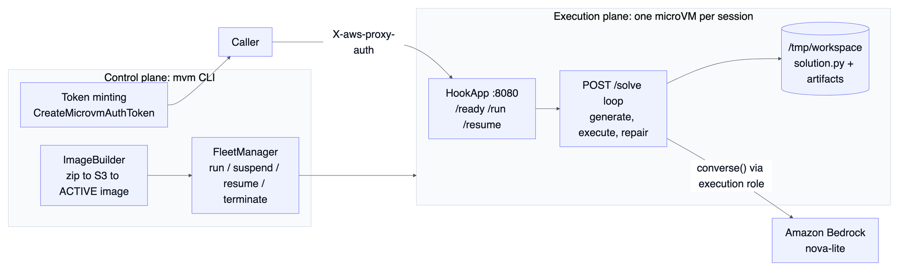

Every agentic coding product has the same uncomfortable step: an LLM emits code nobody has reviewed, and something has to execute it. That something usually shares a kernel, a filesystem, or a credential set with things you care about. In this article I put the whole loop (Bedrock call, code execution, traceback, retry) inside one Lambda MicroVM. If the model writes shutil.rmtree("/"), it destroys a Firecracker VM I was going to terminate anyway.

This is part 3 of the series Building on AWS Lambda MicroVMs. Everything here was run against the live service in us-east-1 in August 2026.

## Why a microVM and not a container or a Lambda function

For untrusted, model-written code the isolation question comes first.

A container shares the host kernel, and a code-execution product is exactly the workload that invites escapes, because the attacker gets to write the payload by prompting your model. A Firecracker microVM gives the code its own kernel, the same boundary AWS uses to separate Lambda tenants.

A Lambda function has the right isolation but the wrong shape. The self-repair loop is stateful and iterative. Generated files stay in the workspace across attempts, and a session may spread over minutes or hours of human back-and-forth. Lambda's short, stateless invocations with no suspend fight that shape. A microVM with suspend and resume matches it.

An EC2 instance has the isolation and the statefulness, but boots in minutes and bills whether the agent is thinking or not. My microVMs go from API call to serving authenticated traffic in p50 3.54 s (p95 4.49 s), and a suspended VM costs storage only, $0.08 per GB-month on a 0.61 GB snapshot.

The decision for this use case in one line: kernel-level isolation per session, a persistent workspace within the session, and a per-second bill that goes to near zero when the human walks away.

## Architecture



The control plane builds the image, launches, suspends, and terminates VMs, and mints the port-scoped JWE auth tokens (1 to 60 minute TTL) that callers present as X-aws-proxy-auth at the VM's dedicated endpoint. Each VM gets its own hostname of the form id.lambda-microvm.us-east-1.on.aws. The execution plane is a single standard-library Python server inside the VM that answers the platform's lifecycle hooks (/ready, /run, /resume) and one application route, POST /solve, where the entire generate, execute, repair loop runs. The only thing that leaves the VM during a session is the Bedrock API call.

## Build it

The image is deliberately plain: a Python 3.12 toolchain with the libraries the model's code is likely to want.

```dockerfile
FROM public.ecr.aws/lambda/microvms:al2023-minimal

RUN dnf install -y python3.12 python3.12-pip && dnf clean all
RUN python3.12 -m pip install --no-cache-dir boto3 numpy pandas matplotlib

WORKDIR /app
COPY microvm_hooks.py app.py /app/

EXPOSE 8080
ENTRYPOINT ["python3.12", "/app/app.py"]
```

```console
$ mvm image build ai-code-runner examples/ai-code-runner --memory 2048
```

The build ran in 144.6 s and produced a 608 MB memory snapshot plus a 24 MB disk snapshot. That memory snapshot shapes the whole application design: every VM you launch is a restored clone of the build VM's RAM. Whatever existed in memory at snapshot time (RNG state, open sockets, and, if you were careless, credentials) is duplicated into every clone.

That is why the app refuses to create its Bedrock client at import time:

```python
_bedrock = None  # created lazily in /run, never at build time (dead connections in the snapshot)

@app.on_run
def on_run(_ctx):
    global _bedrock
    import boto3
    _bedrock = boto3.client("bedrock-runtime",
                            region_name=os.environ.get("AWS_REGION", "us-east-1"))

@app.on_resume
def on_resume(ctx):
    on_run(ctx)  # refresh the client: pre-suspend connections may be dead
```

Three hooks, three reasons:

- /ready creates /tmp/workspace and returns True. The platform only snapshots after /ready returns 200, so this is your last chance to shape what gets cloned.
- /run fires on each freshly launched clone. This is where the boto3 client is born, so its credentials come from the VM's execution role, resolved at runtime and per VM. Nothing secret is ever baked into the image, because a snapshot turns RAM into stored data. An API key held in a Python variable at build time would ship, at rest, inside every copy of a 608 MB file.
- /resume re-runs the same initialization, because a client that survived suspend is holding TCP connections that died while the VM was frozen.

The loop itself is 20 lines. Generate a script, run it as a subprocess in the workspace, and if it exits non-zero, hand the traceback straight back to the model:

```python
for i in range(int(body.get("max_iterations", 3))):
    code = _generate(messages)          # Bedrock converse(), nova-lite, temperature 0.2
    result = _execute(code)             # python3.12 solution.py, 60 s timeout
    if result["exit_code"] == 0:
        return 200, {"solved": True, "iterations": i + 1, "code": code,
                     "stdout": result["stdout"], "attempts": attempts,
                     "artifacts": sorted(os.listdir(WORKSPACE))}
    messages.append({"role": "assistant", "content": [{"text": code}]})
    messages.append({"role": "user", "content": [
        {"text": f"That failed:\n{result['stderr'][-3000:]}\nFix it. Full script only."}
    ]})
```

There is no sandboxing inside the VM, no import allowlist, and no seccomp work. The subprocess runs with a 60 second timeout and otherwise full freedom, because the VM boundary is the sandbox. Anything the code writes, a plot from matplotlib or a CSV from pandas, lands in /tmp/workspace, is reported back in the artifacts list, and persists across /solve calls and across suspend and resume for the life of the session.

## Run it

The captured transcript:


The VM went from `mvm run ai-code-runner --wait` to serving in 15.7 s in this capture. The --wait flag polls conservatively; the measured p50 from launch to first authenticated byte is 3.54 s. I posted the task "Compute the first 8 Fibonacci numbers and print them as a Python list", and one POST /solve returned:

```json
{
  "solved": true,
  "iterations": 1,
  "stdout": "[0, 1, 1, 2, 3, 5, 8, 13]\n",
  "attempts": [{"iteration": 1, "exit_code": 0, "duration_ms": 1250.9}],
  "artifacts": ["solution.py"]
}
```

Nova-lite's first draft, a plain fibonacci(n) with a while loop, visible in full in the code field of the transcript, ran clean in 1,250.9 ms of subprocess time, so the repair loop never fired. When a first draft is broken, the traceback round-trips through the messages list and the next attempt runs clean. Either way the execution-plane overhead per round trip is about 111 ms (warm p50, including TLS, proxy auth, and the subprocess), so the model's thinking time dominates. The workspace ends the session holding solution.py, and the VM is terminated.

One aside from an earlier capture: I launched this VM without its execution role attached, and the very first converse() call threw botocore.exceptions.NoCredentialsError instantly. That failure is the design working. There was no fallback key to find, in an environment variable or anywhere in 608 MB of cloned RAM, because I never put one there. A missing role fails as a clean traceback, never as a silently shared credential.

## What it costs

Rates in us-east-1, per-second billing, vCPU fixed at memory divided by 2:

| Item | Rate |
|---|---|
| vCPU | $0.0000276944 per vCPU-second |
| Memory | $0.0000036667 per GB-second |
| Snapshot write / read | $0.0038 / $0.00155 per GB |
| Suspended and image storage | $0.08 per GB-month |

Worked example from my cost model for this exact shape, 2 GB / 1 vCPU with the 0.61 GB measured snapshot. An agentic coding session is bursty: minutes of active generate, run, fix, then hours where the human is reviewing, in a meeting, or asleep, and the workspace must survive.

| Session shape | MicroVM | Always-on 2 GB container | Saved |
|---|---|---|---|
| One-shot solve, terminate (8 s) | $0.0003 | n/a | n/a |
| 30 min active + 8 h suspended | $0.0669 | $1.0719 | 93.8% |
| 2 h active + 22 h suspended | $0.2602 | $3.0264 | 91.4% |

A suspend and resume cycle on the 0.61 GB snapshot costs about $0.0033 in snapshot write plus read, so do not reflexively suspend a job you will never come back to. Terminate one-shots. If your workload is busy around the clock, an always-on VM is about $3.03 per day and Fargate wins; suspend economics are the whole argument here. Bedrock tokens are billed separately by that service. Nova-lite sits at the cheap end, which is why it is the default MODEL_ID.

## The gotchas

- Snapshots turn RAM into stored data. This shaped the design rather than biting me in production: no client construction at build time, secrets only via the execution role in /run, RNG reseeded by the hook server on every launch. Audit anything your framework initializes at import time.
- Resumed connections are dead. /resume must rebuild the Bedrock client. A suspended VM's TCP connections do not survive the freeze. My on_resume calls on_run again.
- No execution role means no Bedrock, loudly. Treat NoCredentialsError from inside the VM as "check the role on RunMicrovm", never as a reason to bake in a key.
- New-account quotas will surprise you. My fresh account had an applied memory quota of 8 GB (published default: 1,024 GB) that counts RUNNING, SUSPENDED, TERMINATING, and image-build VMs, plus a RunMicrovm rate of 1 per second. A per-session-VM product hits both immediately. My FleetManager reads applied quotas at startup and throttles to 80% of them. Request raises on day one.
- Sessions have a ceiling. Total VM lifetime maxes out at 8 h (28,800 s). A long coding session needs a plan for checkpointing the workspace to S3 and re-launching.

## Take it further

- Fan out verification. Launch N clones of this image and have each attempt the same task independently. Part 4 of this series, the agent evaluation fleet, does exactly this, and clones from one snapshot make N-way sampling cheap.
- Ship artifacts to S3 from inside the VM. The endpoint has a bandwidth cap (1 MB/s at 0.5 GB, up to 16 MB/s at 8 GB). A generated dataset or plot bundle should leave via the execution role and S3.
- Swap the model per deployment. MODEL_ID is an image-level environment variable, shared by every clone of the image. Per-tenant configuration belongs in runHookPayload, which part 9 on multi-tenant agents covers.

This example and all eight images are in [awesome-microvm](https://github.com/Vivek0712/awesome-microvm). The plane and benchmark harness are [microvm-ctl](https://github.com/Vivek0712/microvm-ctl). This is part 3 of Building on AWS Lambda MicroVMs. Part 2 built the code sandbox this runner is based on; part 4 fans the same idea across a fleet.
