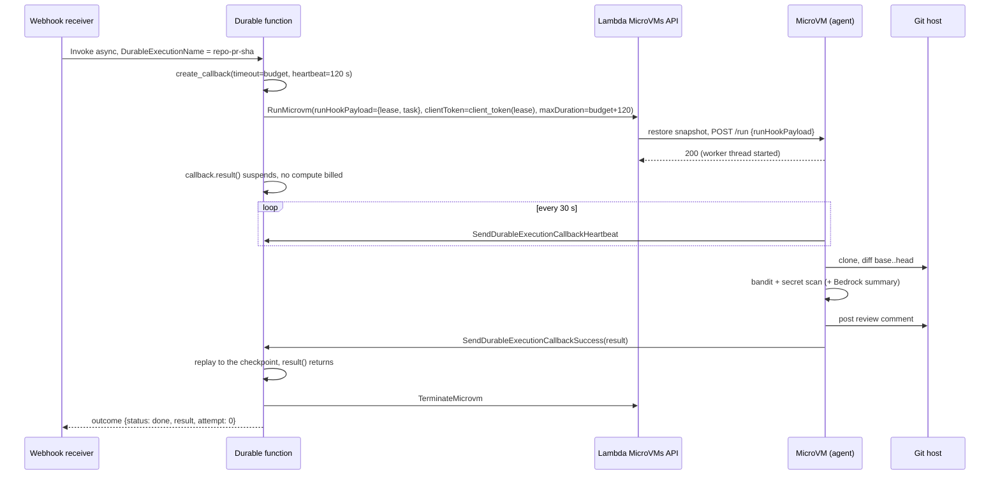
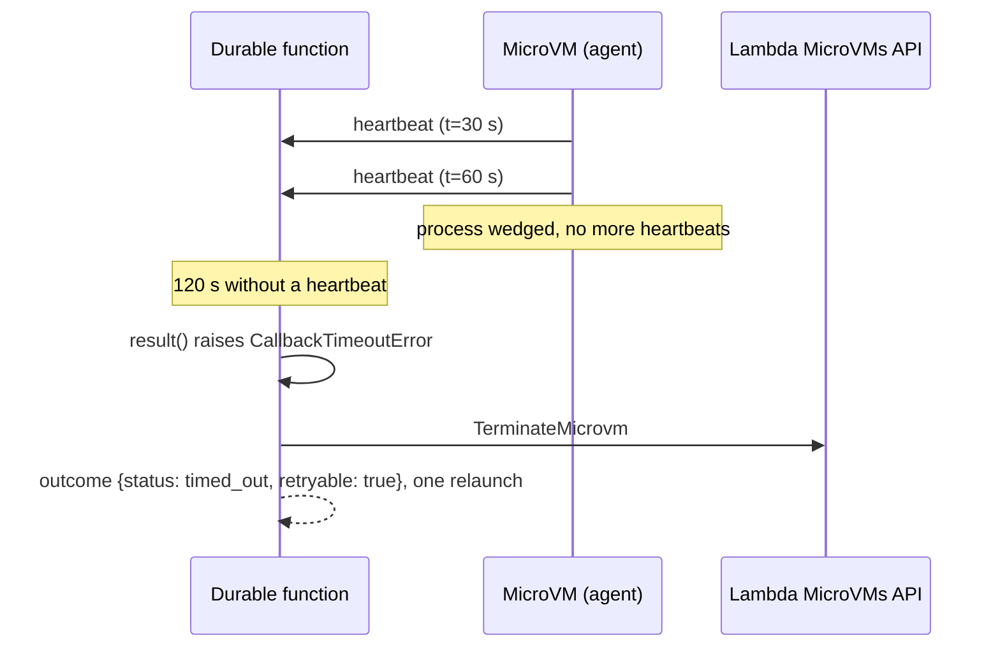

A durable function is the right place to own a workflow and the wrong place to run untrusted code. A MicroVM is the right place to run untrusted code and has no idea what a workflow is. AWS's own workshop, "Running AI agent-generated code securely", wires the two together in its second module: a pull request lands, a durable function launches a MicroVM from a reviewer image, the reviewer clones the repository, reviews the diff inside the sandbox, posts the review on the pull request, calls back, and the durable function terminates the VM. I rebuilt that handoff on microvm-ctl and tightened every joint I could find. This article is the pattern that came out of it, which I call the lease.

This is a companion piece to the series Building on AWS Lambda MicroVMs, and the durable-function half of [the handoff article](../03-handoff.md), which runs the same lease contract under Step Functions, a queue, a bus, and a plain HTTP collector. Since the first draft the lease has moved out of the example and into microvm-ctl as microvm.lease and microvm.integrations.durable, and the whole stack has run end to end on the live service; the execution history from 2026-09-20 is quoted under Run it. Every number below is either the workshop's published observation or something I measured; I have invented none.

## How the workshop does it, and where it leaks

The lab's orchestrator is about a hundred lines of Python on the durable execution SDK, and it reads cleanly. A step calls RunMicrovm. A wait_for_condition polls GetMicrovm every 2 s, up to 150 times, until the VM reports RUNNING. A step mints a port-scoped auth token. The function calls create_callback, then a step POSTs to the VM's /review endpoint with the callback id in the body and expects a 202. The function suspends on callback.result(). When the VM calls SendDurableExecutionCallbackSuccess, the function wakes, a step calls TerminateMicrovm, and it returns the review. The workshop measured an 80.9 s wall-clock review for which the orchestrator billed about 3 s of compute across four short invocations, which is the whole economic point of a durable function: it sleeps for free while someone else works.

Read it a second time as an operator and the gaps show.

The callback has no timeout and no heartbeat. callback.result() with a default CallbackConfig waits until the function's ExecutionTimeout, an hour in the lab. If the reviewer crashes, the orchestrator sleeps for an hour and the VM sits RUNNING until its idle policy notices.

There is no try/except around the wait. A SendDurableExecutionCallbackFailure from the VM raises out of the handler, the terminate step never runs, and the VM is left to a 300 s idle policy plus 60 s suspended to clean it up.

The launch is not idempotent. If the invocation dies after RunMicrovm returns but before the step checkpoint commits, the replay launches a second VM and the first one is orphaned.

The callback id travels over the endpoint. That costs a poll loop until RUNNING, a token mint, and one more authenticated hop, all of which have to succeed before the VM even knows what to do.

Duplicate pushes start duplicate executions. Every push to the branch is a new execution and a new VM, including CodeCommit's own test trigger unless you guard for it, which the lab does.

None of these are bugs in a lab. They are exactly the things a lab leaves out so you can see the shape. The lease is what I put back.

## The lease

A durable callback id is a single-use bearer token generated by the service when the function calls create_callback. Only the holder can complete it, it can be completed once, and it expires. That is a lease. The pattern hands the lease to the VM at birth and makes every other decision follow from it.



In the example, the orchestrator's side of all that is one call, and everything below is what the call does:

```python
from microvm import FleetManager, LeasePolicy, PlaneConfig
from microvm.integrations.durable import lease_with_relaunch

POLICY = LeasePolicy(budget_s=BUDGET_S, heartbeat_timeout_s=HEARTBEAT_TIMEOUT_S, slack_s=SLACK_S)


def review(context: DurableContext, task: dict, label: str = "review") -> dict:
    """One review on one leased VM, relaunched once on a retryable outcome. The outcome
    is the library's: {"status": "done" | "failed" | "timed_out", "result" | "error",
    "retryable", "vm", "attempt"}."""
    return lease_with_relaunch(context, FM, IMAGE, task, max_relaunches=MAX_RELAUNCHES, label=label,
                               policy=POLICY, version=IMAGE_VERSION)
```

Step by step, with the failure each piece exists to prevent.

create_callback first, launch second. The callback has to exist before the VM does, because the VM needs the id at launch. The configuration carries two clocks, both from LeasePolicy: a timeout equal to the job budget (budget_s, 900 s by default) so no review can hold the execution past its worth, and a heartbeat timeout (heartbeat_timeout_s, 120 s) so a dead VM is noticed within two minutes rather than fifteen. Without the timeout, a crashed reviewer costs you the whole ExecutionTimeout. Without the heartbeat, a hung reviewer costs you the whole budget.

The lease rides in runHookPayload. RunMicrovm's runHookPayload is the only per-VM channel that exists at launch time, and Lambda delivers it to the /run hook before the endpoint opens. encode_payload serializes {lease, task} into it, where the lease is {kind: durable, token: <callback id>, region, heartbeat_s: 30, id: <execution name>}, and refuses anything over the 4,096 character limit rather than letting the service do it. The VM is working the moment /run fires. No polling for RUNNING, no token, no POST. Three network round trips and their failure modes are gone.

The launch is one step with at-most-once semantics, no SDK retries, and a clientToken. StepSemantics.AT_MOST_ONCE_PER_RETRY makes the SDK confirm the START checkpoint before running the step body, so a replay never re-enters a step that already ran. RetryPresets.none() stops the SDK from retrying a launch that threw after the API accepted it. The clientToken makes the service itself idempotent: microvm.lease.client_token hashes the lease kind, the callback id, and the lease id with SHA-256, so if the same request does arrive twice, RunMicrovm returns the same microVM. FleetManager.lease is the one call that encodes the payload, applies the policy's idle policy and duration cap, and sets that token. One finding from the live runs: the hash is only safe because the callback id is single-use. A lease with no token (kind none, what mvm lease run --kind none launches) has nothing single-use to key on, and reusing a clientToken there makes the service answer "clientToken was used with different request parameters", which is why client_token salts kind none with a fresh uuid on every call.

```python
callback = context.create_callback(
    name=f"{label}-callback",
    config=CallbackConfig(
        timeout=Duration.from_seconds(policy.budget_s),
        heartbeat_timeout=Duration.from_seconds(policy.heartbeat_timeout_s),
    ),
)
lease = Lease(kind="durable", token=callback.callback_id, region=region,
              heartbeat_s=heartbeat_s, id=execution_name(context))
launch_once = StepConfig(step_semantics=StepSemantics.AT_MOST_ONCE_PER_RETRY,
                         retry_strategy=RetryPresets.none())
vm = context.step(
    _launch(fm, image, lease.to_dict(), task, policy_dict, version, execution_role),
    name=f"{label}-launch", config=launch_once,
)
```

The _launch step body is a single fm.lease(image, lease, task, policy) call that returns the VM id and endpoint for the checkpoint.

The VM heartbeats. The hook runtime, not the agent, owns this: a daemon thread calls SendDurableExecutionCallbackHeartbeat every heartbeat_s seconds. When that call returns CallbackTimeoutException, the orchestrator has stopped waiting; the runtime marks the lease lost, and the agent's lease.check() between phases raises LeaseLost and the pipeline stops. Nobody is waiting, so stop spending.

The VM completes with a typed result or a typed failure. The agent is an @app.on_lease handler: whatever it returns goes out as SendDurableExecutionCallbackSuccess, and a LeaseError it raises goes out as SendDurableExecutionCallbackFailure with the error type as ErrorType and the whole completion payload, retryable flag included, as ErrorData. The review agent's vocabulary is CloneFailed, ScanFailed, PostFailed, and BadPayload; the runtime adds Unexpected for anything else and Terminated for a /terminate that lands mid-review. Success stays under the 256 KB callback limit: counts, the top fifty findings, and an S3 key for the full report if a bucket is configured.

```python
from microvm_hooks import HookApp, LeaseError

app = HookApp()
ReviewError = LeaseError                       # typed, structured failures; the runtime delivers them


@app.on_lease
def review(task: dict, lease) -> dict:
    """The leased path: the runtime heartbeats, completes, and fails the callback for us."""
    return _review(task, lease)


def _clone(task: dict) -> str:
    app.job.phase("cloning")
    ...
    proc = _sh(["git", "clone", "--no-checkout", "--filter=blob:none", "--", url, WORK_DIR], timeout=180)
    if proc.returncode != 0:
        raise ReviewError("CloneFailed", proc.stderr[-800:].replace(url, "<url>"), retryable=True)
```

Inside _review the stages are separated by `check = lease.check if lease else (lambda: None)`, so POST /review, which has no lease, runs the same pipeline with the check as a no-op. On the other side, lease_microvm reads the error object back out of ErrorData, and the outcome's retryable flag is what lease_with_relaunch uses to decide whether to lease a second VM.

The orchestrator terminates in every branch it can see. Success, CallbackTimeoutError, CallbackExternalError: each path runs the terminate step before doing anything else. The step swallows ResourceNotFoundException, because the VM may already have hit its own duration cap.

Two guards cover the branches the orchestrator cannot see. maximumDurationInSeconds is LeasePolicy.max_duration(), the budget plus 120 s of slack, so the service kills the VM on its own if the execution vanishes. And a five-minute scheduled janitor calls Fleet.reap on the agent image with the same ceiling, which catches the one case the documentation is explicit about: StopDurableExecution kills the invocation at the next checkpoint and no except block runs. The hook runtime's /terminate handler sends a retryable Terminated failure if the lease was still open, so a janitor kill tells the orchestrator immediately instead of at the heartbeat timeout.



## The rule that is easy to get wrong

The obvious way to guarantee cleanup is try/finally around the wait. In the Python SDK that terminates your VM at the moment the function goes to sleep. callback.result() implements suspension by raising SuspendExecution out of the call when the result is not in yet; the invocation ends, and Lambda re-invokes when the callback completes. A finally block runs on that raise and would call TerminateMicrovm on a VM that had just started working; the replay would then find a closed lease. SuspendExecution derives from BaseException, so a bare except Exception does not catch it, but it would swallow every real error and is no substitute for catching the two CallbackError subclasses by name.

lease_microvm catches only what it means to catch, and each branch ends in its own terminate step:

```python
try:
    raw = callback.result()  # suspends here; no compute billed while the VM works
except CallbackTimeoutError as e:
    context.step(_terminate(fm, vm["microvm_id"]), name=f"{label}-terminate")
    return {"status": "timed_out", "retryable": True, "vm": vm,
            "error": {"error_type": "CallbackTimeout", "message": str(e), "retryable": True, "data": {}}}
except CallbackExternalError as e:
    context.step(_terminate(fm, vm["microvm_id"]), name=f"{label}-terminate")
    err = _error_from(e)
    return {"status": "failed", "error": err, "retryable": err["retryable"], "vm": vm}

context.step(_terminate(fm, vm["microvm_id"]), name=f"{label}-terminate")
payload = _decode(raw)
result = payload.get("result", payload) if isinstance(payload, dict) and "result" in payload else payload
return {"status": "done", "result": result, "retryable": False, "vm": vm}
```

CallbackTimeoutError covers both the hard timeout and a missed heartbeat. CallbackExternalError is the VM saying no, with the error object intact. lease_with_relaunch loops over lease_microvm while the outcome is retryable, up to MAX_RELAUNCHES more times (1 by default), each attempt with a fresh callback id, a fresh VM, and its own label (review-0, review-1), and stamps attempt on the outcome. A failure is retryable when the VM said so: the review agent flags CloneFailed and PostFailed, the runtime flags Terminated. A timeout is retryable too; a missed heartbeat is far more often a dead VM than a job that cannot fit its budget, and the cap on relaunches bounds the cost of being wrong about that.

## Idempotency lives at three layers

The webhook receiver derives the execution name from repository, pull request number, and the first twelve characters of the head SHA, then invokes the orchestrator asynchronously with that DurableExecutionName. GitHub redelivers webhooks; a redelivery with the same name and payload reattaches to the running execution, and a different payload under the same name raises DurableExecutionAlreadyStartedException, which the receiver answers with 200. Two deliveries, one VM.

The launch step is at-most-once, unretried, and carries the clientToken. That is the layer for a crash between the API call and the checkpoint.

The callback itself closes on completion. A second SendDurableExecutionCallbackSuccess gets CallbackTimeoutException back, and the hook runtime treats that as the lease being lost: it logs it and delivers nothing more. If the orchestrator's terminate lands while the agent's success call is in flight, nothing double-counts.

## What each version costs

The durable function bills compute only while an invocation is running, and this workflow has almost no compute in it. The workshop's measurement for an 80.9 s review was four invocations averaging 739 ms, about 3 s billed, against 512 MB provisioned. The rest of the wall clock was the VM working and the function suspended for free.

Durable operations are the other meter, at $8 per million at the time of writing. The lab's shape spends one for create_callback, one for the launch step, one per wait_for_condition poll, one for the token step, one for the dispatch step, and one for terminate, so six plus however many polls it took to see RUNNING. The lease spends three per attempt: create_callback, launch, terminate. Operations are cheap enough that this is about simplicity rather than money, but fewer operations is also fewer checkpoints to persist and fewer places to fail.

The VM is where the money is, and it is small. microvm-ctl's cost model uses the published us-east-1 rates: $0.0000276944 per vCPU-second plus $0.0000036667 per GB-second, so a 2 GB / 1 vCPU agent runs at about $0.126 per hour, or $0.0035 for a 100 s review before the snapshot read. That is the one-shot shape from the CI runner article: terminate, never suspend. A leased VM also holds one baseline of the account's memory quota (8 GB on a fresh account) for exactly as long as the lease, which is why termination in every branch matters more than the cents.

## Run it

Build the agent image with the plane, deploy the orchestrator stack with SAM, then point a git host at it.

```console
$ pip install microvm-ctl
$ mvm bootstrap
$ mvm image build security-review-agent examples/durable-handoff/agent \
    --env GITHUB_TOKEN_SECRET_ARN=arn:aws:secretsmanager:us-east-1:123456789012:secret:github-token
$ cd examples/durable-handoff/orchestrator
$ sam build
$ sam deploy --parameter-overrides ImageName=security-review-agent \
    GitHubTokenSecretArn=arn:aws:secretsmanager:us-east-1:123456789012:secret:github-token \
    WebhookSecretArn=arn:aws:secretsmanager:us-east-1:123456789012:secret:github-webhook
```

The stack creates the durable orchestrator behind a live alias, the webhook receiver with a Function URL, the janitor on a five-minute schedule, and the execution role the agent VM runs as, with SendDurableExecutionCallback* scoped to this one function. Point a GitHub webhook for pull_request events at the WebhookUrl output, or a CodeCommit repository trigger at the OrchestratorAlias output; the handler normalizes both event shapes and looks up the open pull request for a CodeCommit branch in a step.

You do not need a git host to see the lease work. Invoke the orchestrator directly with a task and a deterministic execution name:

```console
$ aws lambda invoke --function-name microvm-durable-handoff-orchestrator:live \
    --invocation-type Event --cli-binary-format raw-in-base64-out \
    --payload '{"task":{"provider":"github","repo":"owner/name","pr":1,"base":"<sha>","head":"<sha>","post":false}}' \
    --durable-execution-name demo-1 /dev/stdout
$ aws lambda list-durable-executions-by-function --function-name microvm-durable-handoff-orchestrator
$ aws lambda get-durable-execution-history --durable-execution-arn <arn>
```

I ran exactly that on 2026-09-20 against the deployed stack, with ImageName=handoff-agent (the shared shell-step agent from examples/handoff-agent, so ImageName can be any image with an @app.on_lease handler) and JobBudgetSeconds=300. The task was three shell steps ending in sleep 8. The execution history, trimmed to the event and its timestamp:

```
ExecutionStarted                            12:26:36.193
CallbackStarted      review-0-callback      12:26:38.548
StepStarted          review-0-launch        12:26:38.582
StepSucceeded        review-0-launch        12:26:39.410
InvocationCompleted                         12:26:39.562
CallbackSucceeded                           12:26:49.371
StepStarted          review-0-terminate     12:26:49.546
StepSucceeded        review-0-terminate     12:26:49.579
InvocationCompleted                         12:26:49.704
ExecutionSucceeded                          12:26:49.704
```

The launch step took 0.83 s, which is RunMicrovm accepting the request, not the VM being ready. From the launch step succeeding to CallbackSucceeded is 9.96 s, and that span is the snapshot restore, /run, the 8 s task, and the callback itself, so everything around the sleep cost under two seconds. The function ran two invocations, one to create the callback and launch, one to wake on the callback and terminate, together well under two seconds of billed compute; it slept through the rest. End to end, ExecutionStarted to ExecutionSucceeded, 13.5 s. The result payload carried the VM id microvm-ad2a1181-1f8b-3d17-b1fe-2a2217a9de11 and "attempt": 0, the library's outcome shape. In another terminal, mvm top --watch shows the VM appear as PENDING, turn RUNNING, and disappear.

The state machine sibling, examples/stepfunctions-handoff, succeeded the same day on the same agent image, and [the handoff article](../03-handoff.md) puts the two side by side with the queue, bus, and HTTP variants.

The agent also runs on its own:

```console
$ mvm run security-review-agent --wait
$ mvm call <id> /review -X POST -d '{"provider":"github","repo":"owner/name","pr":1,"base":"<sha>","head":"<sha>","post":false}'
$ mvm call <id> /status
```

POST /review runs the same clone, diff, scan, and report pipeline synchronously with no callback, and GET /status, which the hook runtime serves for every image, reports the phase, elapsed time, heartbeat count, and findings so far through the authenticated endpoint. Launched without a lease in runHookPayload the agent sits idle and /status says so, which is the correct behaviour for a snapshot that must never carry a task of its own.

## Variants

Fan-out. Durable operations inside one context must be sequential, so concurrency comes from context.map, which gives every item its own child DurableContext. The example's fanout mode leases one VM per shard of paths, each with its own callback and its own clientToken, and collects the outcomes. On a fresh account that is bounded by the 1 launch per second RunMicrovm quota and the 8 GB memory quota, and microvm-ctl's token bucket paces the launches to 80% of the applied rate.

Human in the loop. Create a second callback before the launch and pass both ids in the payload. The agent completes the review callback with the findings, then the orchestrator waits on the approval callback, which a reviewer completes from a Slack button. Only then does a second, short lease post the comment, or the same VM does if you keep it alive on the approval callback's heartbeat.

Reverse handoff. The VM can be the one asking. Give the agent the durable execution's function name, let it invoke a tiny approval function that creates a callback and returns the id, and have the agent block on its own work until that callback completes. The VM pays for the wait, so this only makes sense for short approvals; for anything longer, suspend the VM and let the orchestrator resume it.

## The gotchas

- runHookPayload is 4,096 characters. The task fits; a diff does not. Pass pointers (an S3 key, a commit range) and let the VM fetch. encode_payload refuses a longer payload before RunMicrovm sees it.
- /run must return fast. Lambda holds the launch until /run answers 200, so the hook runtime answers at once and runs the on_lease handler in a daemon thread. A review that ran inside /run would trip the 60 s hook timeout and terminate the VM.
- The callback Result is 256 KB. The agent returns counts, the top fifty findings, and an S3 key; the full markdown report goes to the bucket. The runtime replaces anything over 240 KB with a truncation marker rather than losing the callback.
- Durable execution ARNs are version-qualified, so the IAM Resource for SendDurableExecutionCallback* on the agent role has to end in :*. An unqualified function ARN never matches and the review completes, the comment appears, and the orchestrator sleeps until the heartbeat timeout.
- RunMicrovm callers need lambda:PassNetworkConnector on the managed connector ARNs. An admin user never sees this, because the admin policy already carries it; a Lambda or Step Functions role built from the documented actions does, and the launch step fails on the first attempt. mvm lease policy now includes the statement in the orchestrator document.
- DurableConfig is immutable. Changing ExecutionTimeout or RetentionPeriodInDays replaces the function and drops in-flight executions. Pick them once.
- Durable functions need Python 3.13, and microvm-ctl[durable], the extra that pulls in the SDK, needs 3.11 or later. The SAM template builds and runs on 3.13; the plane itself supports 3.9 through 3.12.
- Read Service Quotas inside a step. FleetManager's constructor calls Service Quotas, a side effect that does not belong in replayed code outside a durable operation, so the example hands the library a lazy proxy that resolves to the real FleetManager on first use, inside the launch step.
- No auto-resume on a leased VM. LeasePolicy.idle_policy() has autoResumeEnabled off and a 60 s suspended ceiling, so a stray request to the endpoint cannot wake a VM whose lease is over.

The example is in [awesome-microvm](https://github.com/Vivek0712/awesome-microvm) under examples/durable-handoff, with the agent image, the orchestrator, the webhook receiver, the janitor, and the SAM template. The plane, including microvm.lease, FleetManager.lease, and microvm.integrations.durable, is [microvm-ctl](https://github.com/Vivek0712/microvm-ctl).
