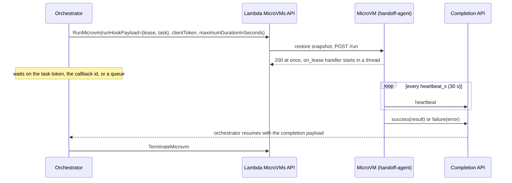

A Lambda MicroVM gives you a machine with a lifecycle and an endpoint. An orchestrator wants something narrower: hand that machine one job, go to sleep, and wake up when the job is done or when it has clearly gone wrong. Every workload in [part 2](https://builder.aws.com/content/3JJ2oNWY9EsZzivMMx044cSlrFQ/seven-workloads-lambda-could-never-run-until-microvms) of this series was driven from a terminal or a harness that called the VM's endpoint. The customers I work with at Aivar do not run their pipelines from terminals. They run them from Step Functions, from Lambda, and from whatever queue their platform team standardized on years ago, and the question they ask is how a state machine hands a VM a task and waits.

Three answers arrived at roughly the same time. Step Functions got SDK integrations for Lambda MicroVMs in August 2026, so a state machine can call RunMicrovm as a task state and wait for a task token. Lambda durable functions have callbacks, a single-use id that an outside process completes. Everyone else has a queue. I did not want three integrations, so I built one contract in [microvm-ctl](https://github.com/Vivek0712/microvm-ctl) and pointed all three at it; the README puts it in one clause, hand a VM a task from Step Functions, Lambda durable functions, or any orchestrator through a lease the VM completes itself. This is part 4 of Building on AWS Lambda MicroVMs, and every number in it was measured on the live service in us-east-1 on 2026-09-20, on an account with a 1 launch per second quota, against a 2 GB image.

## The contract

The idea is small. Whatever token the orchestrator uses to wait (a Step Functions task token, a durable callback id, or a random string you minted) is a lease: single-use, expiring, and only completable by the holder. Instead of polling the VM to RUNNING, minting an endpoint auth token, and POSTing the job in, the orchestrator puts the lease and the task into runHookPayload at launch. Lambda delivers that payload to the /run hook before the endpoint even opens, so the VM is working from its first second and already knows who to tell when it finishes.

```json
{"lease": {"kind": "sfn", "token": "<opaque, up to 1024 chars>", "region": "us-east-1",
           "target": "<URL, queue URL, or bus name; http, sqs, eventbridge only>",
           "heartbeat_s": 30, "id": "<optional label, for example the execution name>"},
 "task": {"repo": "o/r", "pr": 7}}
```

The kind picks the completer inside the VM; everything else is the same for every orchestrator. Four concerns differ per kind, and the table from [docs/integrations.md](https://github.com/Vivek0712/microvm-ctl/blob/main/docs/integrations.md) is the whole map:

| Concern | Step Functions (sfn) | Durable functions (durable) | Generic (http, sqs, eventbridge) |
|---|---|---|---|
| token | task token | callback id | anything you mint |
| complete | SendTaskSuccess / SendTaskFailure | SendDurableExecutionCallbackSuccess / Failure | POST to a URL, SQS message, EventBridge event |
| keep alive | SendTaskHeartbeat against HeartbeatSeconds | SendDurableExecutionCallbackHeartbeat against heartbeat_timeout | optional status messages |
| hard cap | TimeoutSeconds = budget | CallbackConfig.timeout = budget | your timer |
| VM-side cap | maximumDurationInSeconds = budget + slack | same | same |
| idempotent launch | ClientToken from execution and state name | at-most-once step plus clientToken from the callback id | clientToken from the token |
| closed token | TaskTimedOut sets lease.lost | CallbackTimeoutException sets lease.lost | http 404 or 410; no signal for sqs and eventbridge |

In exchange the VM makes five promises, all kept by the hook runtime the image builder injects, not by your code. /run answers 200 immediately and the handler runs in a daemon thread, because Lambda holds the launch until /run returns. A second thread heartbeats every heartbeat_s seconds for the kinds that have something to heartbeat against. Failure is typed: a LeaseError raised by the handler becomes {error_type, message, retryable, data}, any other exception becomes Unexpected with a short trace, and a /terminate that lands mid-task sends Terminated with retryable true, so a janitor kill reaches the orchestrator at once rather than at the heartbeat timeout. A success payload over 240 KB is replaced by a truncation marker, under the 256 KB limit on both AWS completion APIs. And when a heartbeat comes back TaskTimedOut or CallbackTimeoutException, the runtime marks the lease lost, the handler's next lease.check() raises, and the VM stops spending on a result nobody is waiting for.



Every completion carries microvm_id, lease_id, elapsed_s, and either result or error. That microvm_id matters more than it looks: a task token is not a VM id, and the orchestrator only learns which VM it leased when the VM says so. Keep that in mind for the timeout branch below.

On the control plane side the whole thing is one call. FleetManager.lease encodes the payload (and refuses anything over the 4,096 character runHookPayload limit rather than letting the service do it), applies a LeasePolicy whose idle policy has auto-resume off (a leased VM that goes idle is finished, not dormant) and whose maximumDurationInSeconds is budget plus slack, and sets the RunMicrovm clientToken to a hash of the lease so a replayed launch returns the same VM.

```python
from microvm import FleetManager, Lease, LeasePolicy, PlaneConfig

fm = FleetManager(PlaneConfig())
lease = Lease(kind="sqs", token="job-42", target="https://sqs.us-east-1.amazonaws.com/1/results", id="job-42")
policy = LeasePolicy(budget_s=900, heartbeat_timeout_s=120, slack_s=120)
vm = fm.lease("handoff-agent", lease, {"steps": ["make test"]}, policy)
```

## One agent image for every orchestrator

Every orchestrator in this article leases the same image, [examples/handoff-agent](https://github.com/Vivek0712/awesome-microvm/tree/main/examples/handoff-agent). The task is a list of shell steps; each step runs under bash -c, reports a phase, progress, and its output tail, and the first non-zero exit fails the lease with a typed StepFailed. The whole handler is the on_lease decorator plus a loop:

```python
@app.on_lease
def work(task: dict, lease) -> dict:
    steps = task.get("steps") or []
    if not isinstance(steps, list) or not all(isinstance(s, str) for s in steps):
        raise LeaseError("BadTask", "task.steps must be a list of shell strings", data={"steps": steps})
    workdir = task.get("workdir") or DEFAULT_WORKDIR
    os.makedirs(workdir, exist_ok=True)
    env = dict(os.environ, **{str(k): str(v) for k, v in (task.get("env") or {}).items()})
    n, results = len(steps), []
    lease.job.progress(0, n)
    for i, cmd in enumerate(steps):
        lease.check()  # the orchestrator stopped waiting: do not spend on the next step
        lease.job.phase(f"step {i + 1}/{n}")
        lease.job.log(f"$ {cmd}")
        r = _step(cmd, workdir, env)
        results.append(r)
        lease.job.log(r["output_tail"][-400:].rstrip() or "(no output)", exit_code=r["exit_code"],
                      duration_s=r["duration_s"])
        lease.job.progress(i + 1, n)
        if r["exit_code"] != 0:
            raise LeaseError("StepFailed", f"step {i + 1}/{n} exited {r['exit_code']}: {cmd}",
                             retryable=False, data={"step": i, "exit_code": r["exit_code"],
                                                    "output_tail": r["output_tail"][-800:], "steps": results})
```

After the loop come two test aids (hang_s sleeps past any budget to drill the heartbeat timeout, fail_after_s raises a retryable Injected error to drill the relaunch path) and the return value, {passed, steps, microvm_id, heartbeats}, which the runtime delivers as the success payload's result. Nothing in the handler knows which orchestrator is waiting. The job telemetry calls (phase, progress, log) are always on and served at GET /status and streamed at GET /events whether or not there is a lease, which is what mvm status, mvm watch, and the playground read.

The image built in 132 s for version 1 and again for version 3. One intermediate build was interrupted by the service with "Build workflow was interrupted by an exception", and rebuilding it without changes succeeded, so treat that message as transient. Two things went wrong on the first CLI run, both worth having in front of you before you build your own agent. mvm lease run handoff-agent --kind none --wait launched fine, but the second step, python3 -c "print(2+2)", failed because al2023-minimal ships python3.12 only and there is no python3 on PATH; a symlink in the Dockerfile fixed it. The next attempt failed before launch with "The provided clientToken was used with different request parameters", because a token-less lease has nothing single-use to hash and was reusing the same clientToken with a new payload. client_token now salts kind none with a fresh uuid on every call. After that, mvm watch streamed the phases step 1/4 through 4/4 and ended on the line lease none cli-demo heartbeats=0 done.

The playground, the browser UI that ships with microvm-ctl, shows the same lease through its Fleet view. Here it is after a kind none lease of four steps that spent 26.7 s in the VM:

< upload playground-lease.png here: The playground's Fleet view with the Lease card and a completed lease job: playground-demo, 4 steps, 26.7 s in the VM, 0 heartbeats >

The 0 heartbeats is honest and will recur in every run below: kind none has no completer to heartbeat against, and every other task in this article finished inside one 30 s heartbeat interval. The heartbeat thread is exercised in the unit tests and in the hang_s drills, not in these timings.

## Step Functions

mvm lease asl generates a JSONata state machine, and [examples/stepfunctions-handoff](https://github.com/Vivek0712/awesome-microvm/tree/main/examples/stepfunctions-handoff) commits the output as lease.asl.json and inlines it into a CloudFormation template with the stack's ARNs substituted. The state that does the work, trimmed of its Retry block:

```json
"Lease": {
  "Type": "Task",
  "Resource": "arn:aws:states:::aws-sdk:lambdamicrovms:runMicrovm.waitForTaskToken",
  "Arguments": {
    "ImageIdentifier": "arn:aws:lambda:us-east-1:123456789012:microvm-image:handoff-agent",
    "ExecutionRoleArn": "arn:aws:iam::123456789012:role/microvm-sfn-handoff-agent",
    "RunHookPayload": "",
    "IdlePolicy": {"MaxIdleDurationSeconds": 300, "SuspendedDurationSeconds": 60, "AutoResumeEnabled": false},
    "MaximumDurationInSeconds": 420,
    "ClientToken": ""
  },
  "TimeoutSeconds": 300,
  "HeartbeatSeconds": 90,
  "Catch": [{"ErrorEquals": ["States.Timeout", "States.HeartbeatTimeout", "States.TaskFailed"],
             "Assign": {"lease_error": ""}, "Next": "Reap"}],
  "Assign": {"vm": ""},
  "Next": "Terminate"
}
```

Read the Arguments top to bottom and the contract is all there. The task token goes into RunHookPayload, so there is no Lambda function between the state machine and the VM. TimeoutSeconds is the budget, HeartbeatSeconds is three times the VM's 30 s heartbeat, and MaximumDurationInSeconds is budget plus 120 s of slack so the VM dies on its own if the state machine loses track of it. ClientToken is the execution name plus the state name, so a Retry on a throttled RunMicrovm gets the same VM back instead of a second one. The happy path is Lease, Terminate with the microvm_id the VM reported, and Done, whose output is the VM's success payload.

The run. I deployed the stack and ran ./run.sh, which starts an execution with three steps (echo hello, python3 -c "print(2+2)", sleep 5) and polls every 3 s. The first attempt failed immediately with LambdaMicrovms.AccessDeniedException: the state machine role was not authorized to perform lambda:PassNetworkConnector on the INTERNET_EGRESS connector. RunMicrovm passes the ingress and egress connectors even when you name none, an admin user never sees it because the admin policy already carries it, and a role built from the documented actions does not. That finding is now a statement in the orchestrator policy mvm lease policy prints, on arn:aws:lambda:*:aws:network-connector:aws-network-connector:*, and an entry in the troubleshooting guide. With the policy fixed, execution lease-1789932027 showed RUNNING at 12:20:32 and SUCCEEDED at 12:20:36, and its output carried microvm_id microvm-110fe158-bd61-3e32-ab4c-67e9a0637a3e, elapsed_s 5.5, and three passed steps with the outputs hello, 4, and nothing from the sleep.

The branch I did not exercise live is the one that justifies the odd shape of the failure path. A timed-out task returns no output, which means no microvm_id, which means the state machine cannot terminate the VM it leased by name. So the Catch goes to Reap, a listMicrovms call by image, and TerminateStale, a Map that terminates every RUNNING, SUSPENDED, or PENDING member older than the VM cap. Reaping by age rather than by id is safe precisely because every leased VM carries the same maximumDurationInSeconds: anything older than the cap on this image is a leak by definition, and anything younger is someone else's live lease. The execution then ends in Failed with error LeaseFailed and the caught error as the cause, and the VM's next heartbeat gets TaskTimedOut, which sets lease.lost and stops the work. I have run this branch through the unit tests and the hang_s test aid against the library, not through a live timeout of the deployed machine.

One constraint to design around: Standard workflows only. Express workflows cannot wait for a task token, so a lease from an Express workflow has to nest a Standard one.

## Lambda durable functions

The durable version is a library function rather than a document. microvm.integrations.durable.lease_microvm creates the callback with timeout equal to the budget and heartbeat_timeout equal to the policy's, launches through FleetManager.lease inside a step with at-most-once semantics and no SDK retries (so a replay after a crash between the API call and the checkpoint gets the same VM back through the clientToken rather than a second VM), suspends on callback.result(), and terminates the VM in every branch it can see. It returns {status: done | timed_out | failed, result | error, retryable, vm} without raising for any of those, and lease_with_relaunch loops over it while the outcome is retryable, up to max_relaunches more times, each attempt with a fresh callback, a fresh VM, and its own label.

The orchestrator in [examples/durable-handoff](https://github.com/Vivek0712/awesome-microvm/tree/main/examples/durable-handoff) reduces to one call around that:

```python
POLICY = LeasePolicy(budget_s=BUDGET_S, heartbeat_timeout_s=HEARTBEAT_TIMEOUT_S, slack_s=SLACK_S)

def review(context: DurableContext, task: dict, label: str = "review") -> dict:
    return lease_with_relaunch(context, FM, IMAGE, task, max_relaunches=MAX_RELAUNCHES, label=label,
                               policy=POLICY, version=IMAGE_VERSION)
```

The rule that is easy to get wrong deserves its own paragraph, because the obvious code is the broken code. Do not wrap callback.result() in try/finally. The Python SDK suspends the execution by raising SuspendExecution, a BaseException, out of result(); the invocation ends and Lambda re-invokes when the callback completes. A finally block runs on that raise and would terminate your VM at the moment the function went to sleep. The library catches CallbackTimeoutError and CallbackExternalError by name, terminates in each except branch and once more on the success path, and lets everything else propagate.

I invoked the deployed orchestrator directly with the handoff-agent image and a three-step task ending in a short sleep. The execution history, trimmed to the event and its timestamp:

```
ExecutionStarted                            12:26:36.193
CallbackStarted      review-0-callback      12:26:38.548
StepStarted          review-0-launch        12:26:38.582
StepSucceeded        review-0-launch        12:26:39.410
InvocationCompleted                         12:26:39.562
CallbackSucceeded                           12:26:49.371
StepStarted          review-0-terminate     12:26:49.546
StepSucceeded        review-0-terminate     12:26:49.579
InvocationCompleted                         12:26:49.704
ExecutionSucceeded                          12:26:49.704
```

13.5 s end to end across two short invocations: one to create the callback and launch, one to wake on the callback and terminate. The launch step took 0.83 s, which is RunMicrovm accepting the request, and between the launch step succeeding and CallbackSucceeded the function was suspended and billing nothing while the VM restored, ran the steps, and completed the callback. That example also carries a webhook receiver with deterministic execution names so redelivered pull request events reattach, a five-minute janitor that reaps by age, and a security review agent on the same runtime. The long write-up of the durable half, including the workshop it was shaped after and each failure mode the pieces exist to prevent, is [the durable handoff deep dive](deep-dives/09-durable-handoff.md); I will not repeat it here.

## Your own controller

Most pipelines are neither a state machine nor a durable function, and [examples/generic-handoff](https://github.com/Vivek0712/awesome-microvm/tree/main/examples/generic-handoff) is for them: a plain Python script that mints a token, calls FleetManager.lease, and waits for the VM's messages over whichever transport you pass as --kind. All three transports end in one SQS queue the controller long-polls, so the loop is identical and only the setup differs.

With sqs the VM sends heartbeat, success, and failure bodies straight to a standard queue; the VM role needs sqs:SendMessage on it. With eventbridge the VM calls PutEvents on a bus with detail types microvm.lease.heartbeat, .success, and .failure, and a rule routes them into the queue; the VM role needs events:PutEvents on the bus. With http the VM POSTs JSON to a URL with Authorization: Bearer <token> using urllib only, so the VM role needs nothing and the completer needs no boto3. The example's collector is a 128 MB Lambda behind a public Function URL that appends each POST and its bearer token to the queue. It does not verify the token; it forwards it for the controller to match. That is a demo of the transport, not an authentication design: put a secret comparison in the handler, or switch the URL to AWS_IAM auth with SigV4 from the VM, before pointing anything untrusted at it.

Every message is matched on the per-run token, so a late heartbeat from an earlier run is discarded rather than misattributed. The budget is enforced client-side and a timed_out run is terminated and reported like any other. There is one honest gap: sqs and eventbridge have no closed-token signal, so a VM whose controller has died keeps sending into the queue until its own maximumDurationInSeconds ends it. That cap is the guarantee, which is why FleetManager.lease always sets it.

I ran the controller twice per kind with a 240 s budget. The p50 total from before RunMicrovm returned to the completion message landing in the queue was 5.29 s for http, 8.78 s for sqs, and 7.10 s for eventbridge, all six runs successful, all with zero heartbeats. The raw records are benchmarks/results/handoff/results-{http,sqs,eventbridge}-*.json in the repository. The spread between kinds in a two-run sample is mostly launch variance on a 1 launch per second account and long-poll granularity, not a property of the transports.

## Benchmarks

The comparison that matters is all five kinds on the same image, same task, same account, same afternoon. handoff_bench.py in the microvm-ctl repository leases handoff-agent through each orchestrator, reads the VM's /status for the lease-accepted and done timestamps, and reads the orchestrator's own history for when it resumed. Two runs per kind, three shell steps ending in a short sleep, all ten runs succeeded.

< upload handoff-bench.png here: Lease handoff benchmark across the five kinds: launch to lease, work, completion to resume, end to end, VM seconds, and cost per lease >

| kind | launch to lease | work | completion to resume | end to end | VM s | cost per lease |
|---|---|---|---|---|---|---|
| sfn | 1.6 s | 3.7 s | 0.7 s | 6.3 s | 6 | $0.00030 |
| durable | 2.7 s | 4.4 s | 0.8 s | 8.4 s | 5 | $0.00021 |
| sqs | 1.0 s | 4.5 s | 0.2 s | 5.7 s | 5 | $0.00018 |
| eventbridge | 1.6 s | 6.8 s | 0.2 s | 8.9 s | 5 | $0.00017 |
| http | 1.0 s | 4.7 s | 0.2 s | 5.8 s | 6 | $0.00021 |

Launch to lease is the time from the orchestrator's launch call to the VM logging lease accepted, the snapshot restore plus /run: one to three seconds, consistent with the 3.54 s p50 to serving traffic in [part 1](https://builder.aws.com/content/3JIDTpz0ZgatSBv24drra3gEod9/control-and-scale-aws-lambda-microvms-with-microvm-ctl) minus the endpoint. Work is what the steps took inside the VM; the eventbridge 6.8 s is one slow run of two, not the bus. Completion to resume is where the orchestrators actually differ: Step Functions and durable functions take 0.7 to 0.8 s to notice the completion and run the next state or invocation, a queue poller sees the message in 0.2 s. End to end is 5.7 to 8.9 s for a job that spends about four seconds working, so the handoff costs two to five seconds of wall clock and no orchestrator compute worth mentioning.

The cost column is a model on measured seconds, not a bill. A 2 GB, 1 vCPU VM at the published us-east-1 rates is $0.0000276944 per vCPU-second plus 2 x $0.0000036667 per GB-second, $0.0000350278 per second, times the VM seconds per lease. On top of that Step Functions charges four state transitions at $0.000025 each and the durable function three operations at $0.000008 each; the generic kinds add nothing beyond what the queue or bus costs you already. That makes a Step Functions lease about a third of a cent per thousand more than a queue lease, and none of them reaches a thirtieth of a cent. The VM is the whole bill, and it is a six second VM.

## The gotchas

- runHookPayload is 4,096 characters. The task carries pointers (S3 keys, PR numbers), never bodies. encode_payload refuses a longer payload before RunMicrovm sees it.
- /run must return fast. Lambda holds the launch until /run answers, so the runtime answers at once and runs on_lease in a thread. Do not do the work in an on_run hook.
- Results are capped at 256 KB on both AWS completion APIs. The runtime truncates at 240 KB and keeps the first 4 KB as a summary; put the full report in S3 and return the key.
- Durable execution ARNs are version-qualified, so the IAM resource for SendDurableExecutionCallback* on the VM's role must end in :*. With an unqualified function ARN the review completes, the callback fails, and the orchestrator sleeps until the heartbeat timeout.
- The RunMicrovm caller needs lambda:PassNetworkConnector on the managed connector ARNs. mvm lease policy includes it now; it did not until the first Step Functions attempt failed.
- ClientToken makes retries safe only when the lease token is single-use. A token-less lease reusing a clientToken gets "used with different request parameters" back; the plane salts kind none per call.
- Express workflows cannot wait for a task token. Use a Standard workflow, or nest one.
- A lease token is not a VM id. The orchestrator learns the microvm_id from the completion payload, so a timeout that returns nothing has to reap by image and age.
- Build logs land in /aws/lambda-microvms/<image>, once the execution role is allowed to write there. microvm-ctl assumed /aws/lambda/microvms/<image> until this work; mvm logs follows the service now.
- The VM needs whatever your steps call. al2023-minimal has python3.12 and no python3 on PATH.

The contract is documented in [docs/integrations.md](https://github.com/Vivek0712/microvm-ctl/blob/main/docs/integrations.md) in [microvm-ctl](https://github.com/Vivek0712/microvm-ctl), installable from [PyPI](https://pypi.org/project/microvm-ctl/). The four examples, the benchmark results, and the recordings live in [awesome-microvm](https://github.com/Vivek0712/awesome-microvm). [Part 3](https://builder.aws.com/content/3JJ7tASPSSUUTrcpWnWtxOuu8g3/a-kernel-for-every-customer-scaling-ai-agents-to-1000-tenants-on-aws-lambda-microvms-with-microvm-ctl) of this series closes with the decision guide for which workloads belong on a MicroVM at all; this part is the answer to what happens once one of them has to be started by something other than a person. The table below is the short version.

## Which orchestrator, when

| You have | Lease kind | Why |
|---|---|---|
| A Standard Step Functions workflow, or a team that reads ASL | sfn | No code between the state machine and the VM; the generated machine carries timeout, heartbeat, retry, and reap-by-age; the console shows the wait |
| A workflow that is easier to write in Python than to draw, with branching on results | durable | One library call per lease, the relaunch loop is a for loop, the function sleeps for free while the VM works |
| A queue-based platform, many workers, one consumer | sqs | Cheapest and fastest to resume; the queue is the audit trail; no closed-token signal, so the VM cap is the guarantee |
| Several consumers of the same completions, or a need to fan completions out | eventbridge | One event, many rules; the same caveat on closed tokens |
| A controller outside AWS, CI, a laptop, a language without boto3 | http | urllib only inside the VM, no IAM on the VM role; you own the endpoint and its authentication |
| Debugging an agent, or a demo | none | No completer; watch it through /status, mvm watch, or the playground |

## What to run

```console
pip install microvm-ctl
mvm bootstrap
mvm image build handoff-agent examples/handoff-agent

# by hand, no orchestrator
mvm lease run handoff-agent --kind none --task '{"steps":["echo hi","python3 -c \"print(2+2)\""]}' --wait
mvm watch <id>

# Step Functions
cd examples/stepfunctions-handoff
aws cloudformation deploy --template-file template.yaml --stack-name microvm-sfn-handoff \
    --capabilities CAPABILITY_NAMED_IAM --parameter-overrides ImageName=handoff-agent
./run.sh

# Lambda durable function
cd examples/durable-handoff/orchestrator && sam build && sam deploy --parameter-overrides ImageName=handoff-agent
aws lambda invoke --function-name microvm-durable-handoff-orchestrator:live --invocation-type Event \
    --cli-binary-format raw-in-base64-out --durable-execution-name demo-1 \
    --payload '{"task":{"steps":["echo hello","sleep 5"]}}' /dev/stdout

# your own controller
cd examples/generic-handoff
python3 controller.py --kind sqs --runs 2
python3 controller.py --kind eventbridge
sam deploy -t collector/template.yaml --stack-name microvm-lease-collector --resolve-s3 --capabilities CAPABILITY_IAM
python3 controller.py --kind http

# the IAM each side needs
mvm lease policy --kind sfn --orchestrator arn:aws:states:us-east-1:123456789012:stateMachine:lease
```
